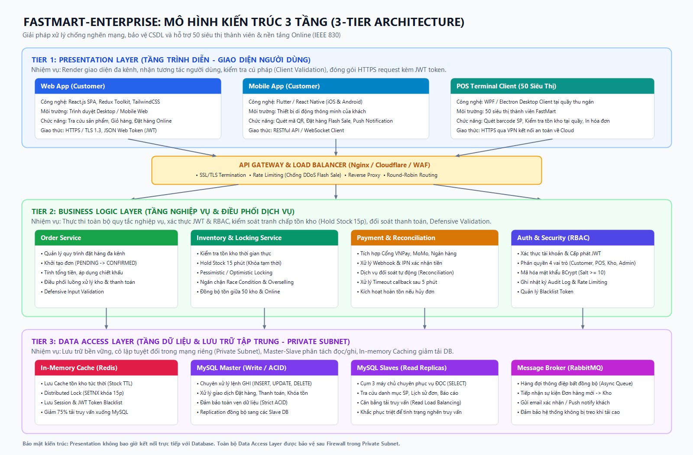
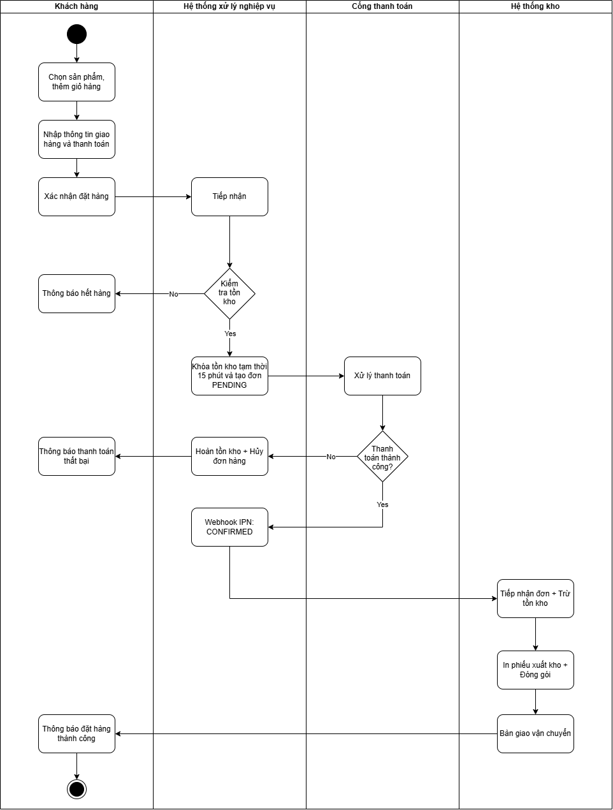
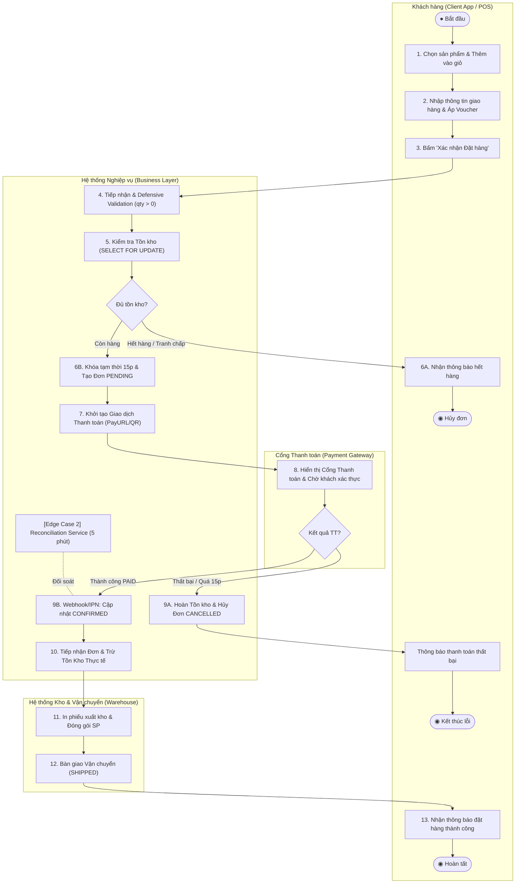
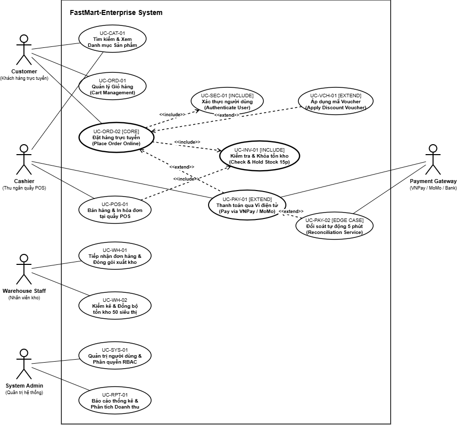
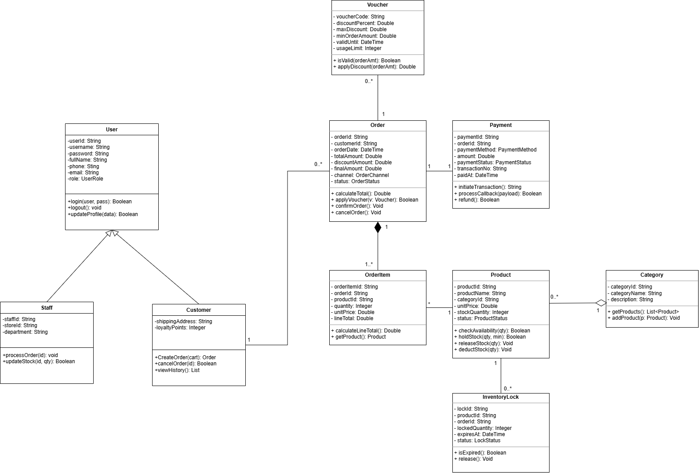
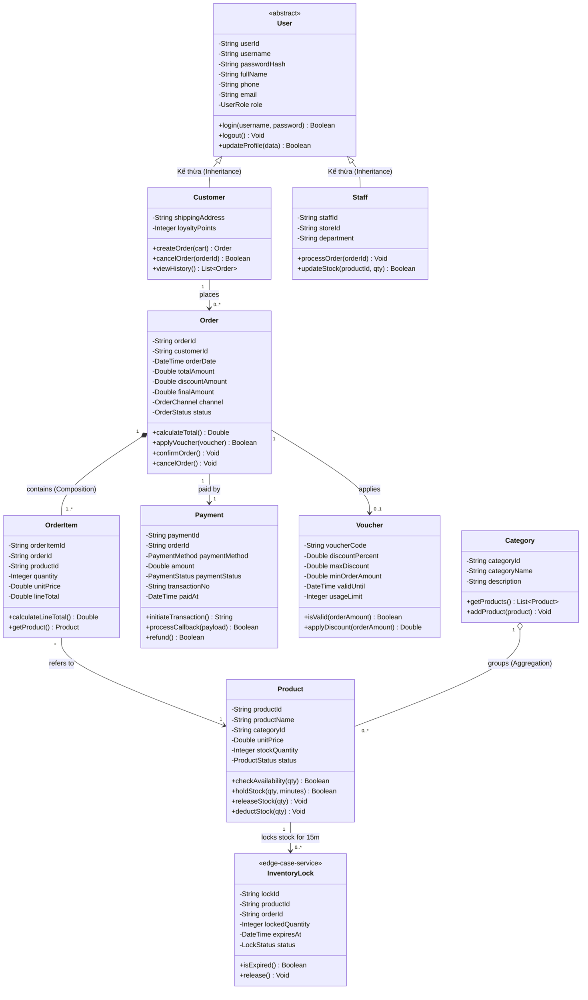
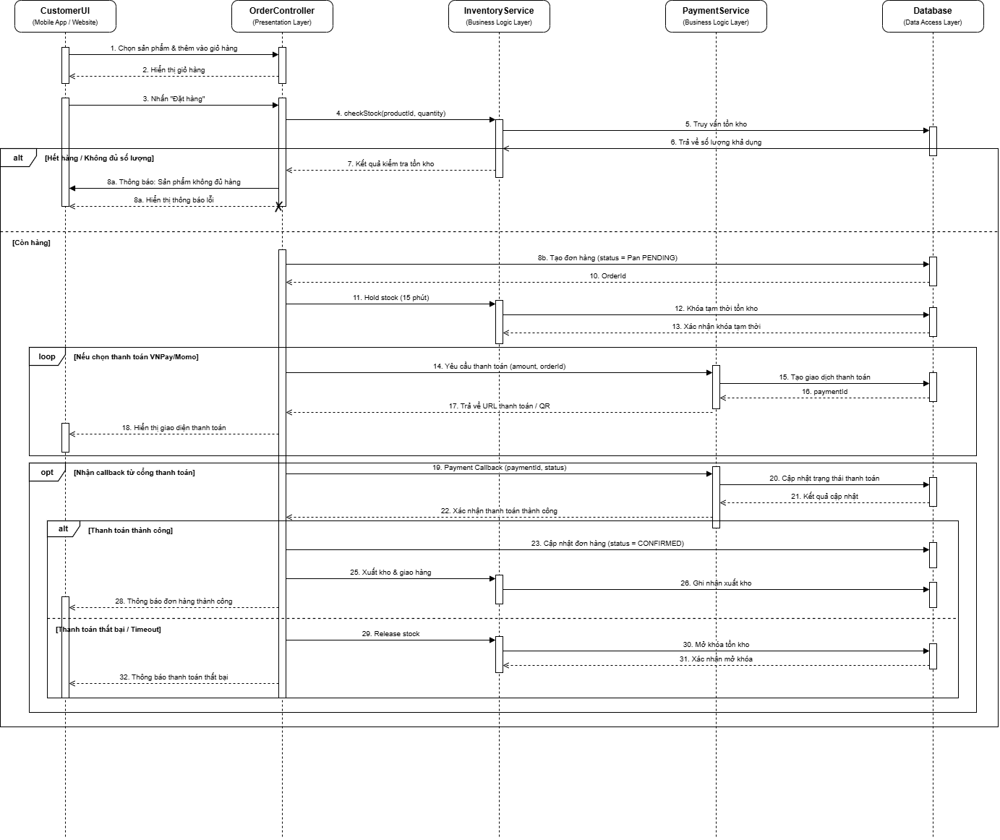
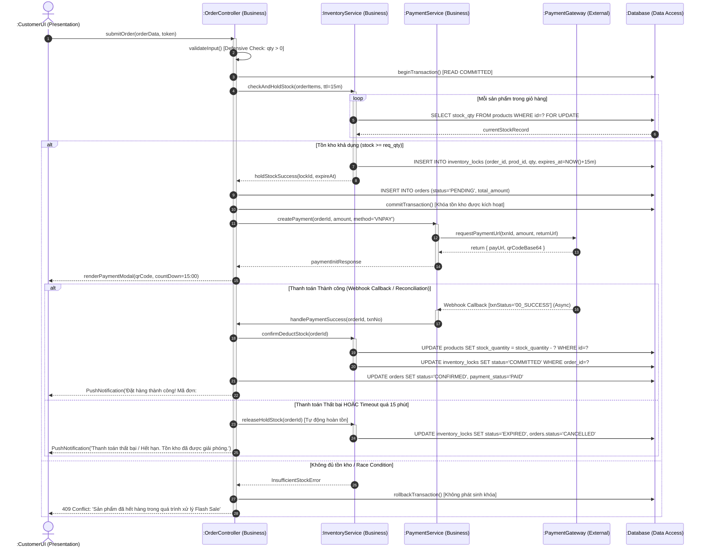
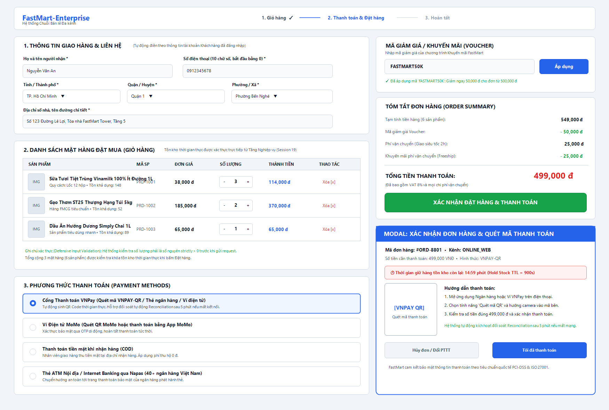
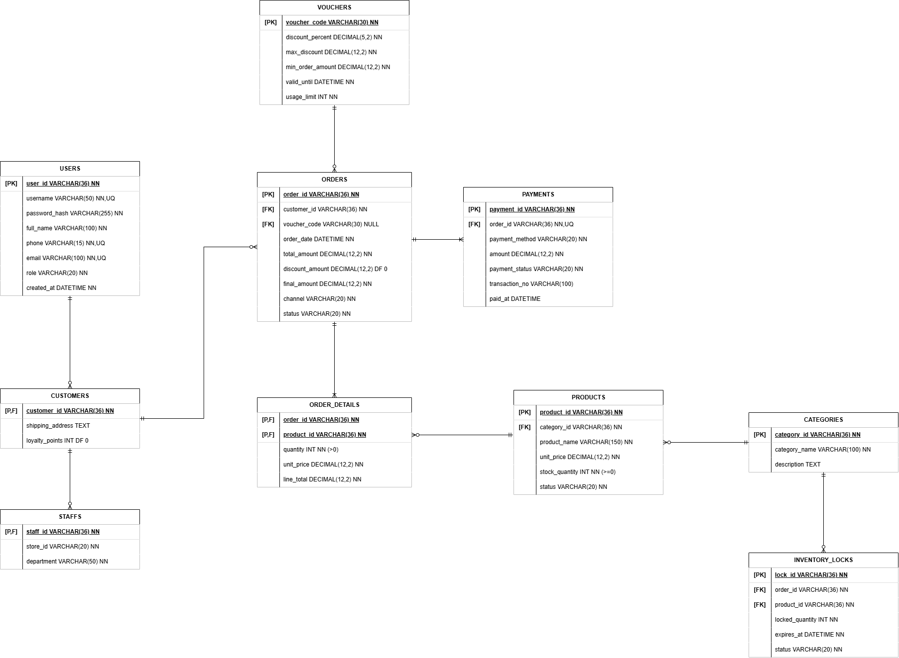

# HỒ SƠ ĐẶC TẢ YÊU CẦU PHẦN MỀM (SRS)
## HỆ THỐNG QUẢN LÝ CHUỖI BÁN LẺ & ĐẶT HÀNG ĐA KÊNH FASTMART-ENTERPRISE (FASTMART-GSP)
**Tiêu chuẩn áp dụng:** IEEE Std 830-1998 / ISO/IEC/IEEE 29148:2018  
**Phiên bản tài liệu:** `v1.0 APPROVED`  
**Ngày phát hành:** `04/10/2026`  

---

### TRANG THÔNG TIN HÀNH CHÍNH DỰ ÁN

| Trường Thông tin | Giá trị Đặc tả |
| :--- | :--- |
| **Tên Dự án** | Hệ thống Quản lý Chuỗi Bán lẻ & Đặt hàng Đa kênh FastMart-Enterprise (FastMart-GSP) |
| **Mã Tài liệu (Document ID)** | `SRS-FM-2026-v1.0` |
| **Phiên bản (Version)** | `v1.0 APPROVED` (Bản Nghiệm thu Chính thức) |
| **Ngày Ban hành (Release Date)** | `04/10/2026` |
| **Đơn vị Thực hiện** | Đội ngũ Phân tích Hệ thống (System Analyst - SA Team) — Bộ môn Phân tích Thiết kế HTTT |
| **Khách hàng Nghiệm thu** | Ban Giám đốc & Hội đồng Quản trị Chuỗi Bán lẻ Đa kênh FastMart Corporation |
| **Mức độ Bảo mật** | `CONFIDENTIAL` (Lưu hành Nội bộ Doanh nghiệp & Nhà thầu Phát triển) |

---

### LỊCH SỬ THAY ĐỔI TÀI LIỆU (DOCUMENT CHANGE LOG)

| Phiên bản | Ngày cập nhật | Người thực hiện | Vai trò | Tóm tắt Nội dung Thay đổi & Lý do | Trạng thái |
| :---: | :---: | :--- | :---: | :--- | :---: |
| **v0.1** | 10/09/2026 | Nhóm SA Lead | System Analyst | Khởi tạo khung tài liệu SRS theo chuẩn IEEE 830, khảo sát hiện trạng hệ thống Monolithic cũ. | *DRAFT* |
| **v0.5** | 18/09/2026 | Nhóm SA Lead | System Analyst | Bổ sung phân tích kiến trúc 3 tầng, Ma trận Stakeholders, xác định 4 FR và 4 NFR chuẩn SMART. | *REVIEW* |
| **v0.8** | 25/09/2026 | Nhóm SA & Tech Lead | SA / Architect | Thiết kế Activity Diagram, Use Case Diagram, Class Diagram 3 ngăn, Sequence Diagram luồng đặt hàng. | *INTERNAL REVIEW* |
| **v0.9** | 30/09/2026 | Nhóm SA & QA Lead | SA / Tester | Bổ sung Wireframe Checkout, thiết kế CSDL ERD đạt chuẩn 3NF, tích hợp giải pháp xử lý 3 Edge Cases. | *PENDING CCB* |
| **v1.0** | 04/10/2026 | Hội đồng Phê duyệt | PM / Sponsor / SA | Ký duyệt nghiệm thu chính thức bàn giao cho Đội Lập trình (Dev) và Kiểm thử (QA/Tester). | **APPROVED** |

---

## MỤC LỤC TỔNG QUAN

- [PHẦN I: GIỚI THIỆU CHUNG (INTRODUCTION)](#phần-i-giới-thiệu-chung-introduction)
  - [1.1. Mục đích của Tài liệu SRS](#11-mục-đích-của-tài-liệu-srs)
  - [1.2. Phạm vi Dự án (Project Scope)](#12-phạm-vi-dự-án-project-scope)
  - [1.3. Định nghĩa, Thuật ngữ & Từ viết tắt](#13-định-nghĩa-thuật-ngữ--từ-viết-tắt)
  - [1.4. Tài liệu Tham chiếu (References)](#14-tài-liệu-tham-chiếu-references)
- [PHẦN II: MÔ TẢ TỔNG QUAN HỆ THỐNG (OVERALL DESCRIPTION)](#phần-ii-mô-tả-tổng-quan-hệ-thống-overall-description)
  - [2.1. Bối cảnh Hệ thống & Kiến trúc 3 Tầng (3-Tier Architecture)](#21-bối-cảnh-hệ-thống--kiến-trúc-3-tầng-3-tier-architecture)
  - [2.2. Phân tích Đột phá: 3 Lý do Mô hình 3 Tầng Triệt tiêu Điểm nghẽn Cũ](#22-phân-tích-đột-phá-3-lý-do-mô-hình-3-tầng-triệt-tiêu-điểm-nghẽn-cũ)
  - [2.3. Ma trận Nhu cầu Tra cứu Stakeholders (Stakeholders Matrix)](#23-ma-trận-nhu-cầu-tra-cứu-stakeholders-stakeholders-matrix)
  - [2.4. Danh mục User Stories Đại diện 3 Vai trò Cốt lõi](#24-danh-mục-user-stories-đại-diện-3-vai-trò-cốt-lõi)
  - [2.5. Ràng buộc Môi trường Vận hành, Kỹ thuật & An ninh mạng](#25-ràng-buộc-môi-trường-vận-hành-kỹ-thuật--an-ninh-mạng)
- [PHẦN III: YÊU CẦU KỸ THUẬT CHI TIẾT (SPECIFIC REQUIREMENTS)](#phần-iii-yêu-cầu-kỹ-thuật-chi-tiết-specific-requirements)
  - [3.1. Danh mục Yêu cầu Chức năng (Functional Requirements - FR)](#31-danh-mục-yêu-cầu-chức-năng-functional-requirements---fr)
  - [3.2. Danh mục Yêu cầu Phi chức năng (Non-Functional Requirements - NFR) Chuẩn SMART](#32-danh-mục-yêu-cầu-phi-chức-năng-non-functional-requirements---nfr-chuẩn-smart)
  - [3.3. Giải pháp Xử lý 03 Bẫy Dữ liệu Dị biệt (Edge Cases Resolution)](#33-giải-pháp-xử-lý-03-bẫy-dữ-liệu-dị-biệt-edge-cases-resolution)
  - [3.4. Mô hình hóa Luồng Nghiệp vụ (Activity Diagram với Swimlanes)](#34-mô-hình-hóa-luồng-nghiệp-vụ-activity-diagram-với-swimlanes)
  - [3.5. Sơ đồ Use Case & Bảng Đặc tả Chi tiết (Use Case Specification)](#35-sơ-đồ-use-case--bảng-đặc-tả-chi-tiết-use-case-specification)
  - [3.6. Thiết kế Cấu trúc Tĩnh: Trích xuất Class Diagram 3 Ngăn Chi tiết](#36-thiết-kế-cấu-trúc-tĩnh-trích-xuất-class-diagram-3-ngăn-chi-tiết)
  - [3.7. Thiết kế Tương tác Động: Sequence Diagram Luồng Đặt hàng & Khóa Tồn](#37-thiết-kế-tương-tác-động-sequence-diagram-luồng-đặt-hàng--khóa-tồn)
  - [3.8. Phác thảo Giao diện Người dùng (UI/UX Wireframe & Mockup Checkout)](#38-phác-thảo-giao-diện-người-dùng-uiux-wireframe--mockup-checkout)
  - [3.9. Thiết kế Cơ sở Dữ liệu & Chứng minh Chuẩn hóa 3NF (ERD)](#39-thiết-kế-cơ-sở-dữ-liệu--chứng-minh-chuẩn-hóa-3nf-erd)
- [PHẦN IV: PHỤ LỤC & QUẢN TRỊ THAY ĐỔI (APPENDICES & GOVERNANCE)](#phần-iv-phụ-lục--quản-trị-thay-đổi-appendices--governance)
  - [4.1. Bảng Từ vựng Nghiệp vụ Bán lẻ Đa kênh (Glossary)](#41-bảng-từ-vựng-nghiệp-vụ-bán-lẻ-đa-kênh-glossary)
  - [4.2. Quy trình Kiểm soát Thay đổi Yêu cầu (CCB Workflow)](#42-quy-trình-kiểm-soát-thay-đổi-yêu-cầu-ccb-workflow)
  - [4.3. Bảng Ký duyệt Nghiệm thu 3 Bên (Approval Signatures)](#43-bảng-ký-duyệt-nghiệm-thu-3-bên-approval-signatures)

---

## PHẦN I: GIỚI THIỆU CHUNG (INTRODUCTION)

### 1.1. Mục đích của Tài liệu SRS
Tài liệu Đặc tả Yêu cầu Phần mềm (Software Requirements Specification - SRS) này được biên soạn bởi đội ngũ System Analyst (SA) nhằm mục đích:
1. **Định nghĩa chuẩn mực toàn diện** về các yêu cầu nghiệp vụ, yêu cầu chức năng (FR) và yêu cầu phi chức năng (NFR) cho hệ thống mới mang tên **FastMart-Enterprise (FastMart-GSP)**.
2. **Làm căn cứ kỹ thuật pháp lý duy nhất** để định hướng Đội ngũ Phát triển Phần mềm (Dev Team: Backend, Frontend Web, Mobile, POS) trong việc xây dựng mã nguồn, đồng thời làm cơ sở tuyệt đối cho Đội ngũ Đảm bảo Chất lượng (QA/Tester) thiết kế Test Plan, Test Cases và tiến hành nghiệm thu UAT.
3. **Thống nhất tầm nhìn và phạm vi** giữa Ban Giám đốc FastMart, Quản lý Dự án (PM) và các đơn vị cung cấp giải pháp công nghệ, giải quyết triệt để vấn đề tranh chấp phạm vi (Scope Creep) từng xảy ra ở hệ thống cũ.

### 1.2. Phạm vi Dự án (Project Scope)
- **Tên hệ thống:** Nền tảng Quản trị Chuỗi Bán lẻ & Đặt hàng Đa kênh FastMart-Enterprise.
- **Quy mô triển khai:** Hỗ trợ đồng bộ hóa vận hành trên **50 siêu thị thành viên** tại các đô thị trọng điểm và **nền tảng bán hàng trực tuyến tập trung** (Web SPA & Mobile App cho hàng triệu người tiêu dùng).
- **Phân hệ thuộc phạm vi hệ thống:**
  1. *Quản lý Đặt hàng Đa kênh (Omnichannel Ordering):* Đặt hàng qua Web/Mobile và bán hàng tại quầy POS.
  2. *Khóa Tồn kho Thời gian thực (Real-time Inventory Lock):* Cơ chế Hold Stock tạm thời 15 phút, giải quyết Race Condition Flash Sale.
  3. *Thanh toán & Tích hợp Cổng Đa kênh (Payment Gateway Integration):* Hỗ trợ COD, Thẻ ATM/Napas, Ví điện tử VNPay/MoMo và cơ chế đối soát tự động (Reconciliation).
  4. *Quản lý Kho & Vận chuyển (Warehouse & Dispatch):* Tiếp nhận đơn CONFIRMED, in phiếu xuất kho, đóng gói, bàn giao vận chuyển.
  5. *Quản lý Danh mục & Sản phẩm (Product Catalog):* Phân loại, giá cả, đơn vị, hình ảnh, khuyến mãi/voucher.
  6. *Báo cáo Thống kê & Phân tích Doanh thu (Analytics & BI):* Doanh thu theo kênh, tồn kho báo động, hiệu suất quầy POS.
  7. *Quản trị Hệ thống & Phân quyền Đa tầng (RBAC Security):* Quản lý tài khoản, phiên đăng nhập, Audit Log.
- **Giới hạn ngoài phạm vi (Out of Scope):** Không bao gồm phân hệ Kế toán tài chính chuyên sâu (General Ledger/ERP Core), quản lý tài sản cố định hoặc quản lý quy trình sản xuất gia công tại nhà máy cung ứng.

### 1.3. Định nghĩa, Thuật ngữ & Từ viết tắt

| Thuật ngữ / Viết tắt | Tên Tiếng Anh đầy đủ | Giải thích Ý nghĩa Nghiệp vụ / Kỹ thuật |
| :--- | :--- | :--- |
| **SA** | System Analyst | Chuyên viên Phân tích Hệ thống chịu trách nhiệm cấu trúc hóa yêu cầu và thiết kế giải pháp. |
| **SRS** | Software Requirements Specification | Hồ sơ Đặc tả Yêu cầu Phần mềm chuẩn IEEE 830 / ISO 29148. |
| **3-Tier** | 3-Tier Architecture | Kiến trúc 3 tầng phân tách: Presentation, Business Logic, Data Access. |
| **FMCG** | Fast-Moving Consumer Goods | Ngành hàng tiêu dùng nhanh (thực phẩm, đồ uống, hóa mỹ phẩm thiết yếu). |
| **POS** | Point of Sale | Điểm bán hàng tại quầy siêu thị (máy tính thu ngân, máy quét barcode, máy in bill). |
| **Hold Stock** | Temporary Inventory Reservation | Cơ chế tạm khóa một số lượng hàng trong kho trong 15 phút chờ khách hàng thanh toán. |
| **Race Condition** | Tranh chấp dữ liệu đồng thời | Hiện tượng nhiều phiên người dùng cùng thao tác cập nhật 1 bản ghi tại cùng 1 millisecond. |
| **CCU** | Concurrent Users | Số lượng người dùng truy cập và tương tác với hệ thống tại cùng một thời điểm. |
| **TPS** | Transactions Per Second | Số lượng giao dịch nghiệp vụ được hệ thống xử lý thành công trong mỗi giây. |
| **Reconciliation** | Payment Reconciliation | Quy trình đối soát chéo dữ liệu giao dịch giữa hệ thống FastMart và Cổng thanh toán ngoại vi. |
| **RBAC** | Role-Based Access Control | Cơ chế phân quyền truy cập chức năng và dữ liệu dựa trên vai trò của người dùng. |
| **3NF** | 3rd Normal Form | Chuẩn hóa CSDL mức 3 (loại bỏ thuộc tính lặp 1NF, phụ thuộc 1 phần 2NF và bắc cầu 3NF). |
| **CCB** | Change Control Board | Hội đồng Kiểm soát Thay đổi Yêu cầu dự án phần mềm. |

### 1.4. Tài liệu Tham chiếu (References)
1. Tiêu chuẩn Quốc tế IEEE Std 830-1998: *IEEE Recommended Practice for Software Requirements Specifications*.
2. Tiêu chuẩn Quốc tế ISO/IEC/IEEE 29148:2018: *Systems and software engineering — Life cycle processes — Requirements engineering*.
3. Bộ tài liệu phân tích hệ thống môn học IT105: Session 01 đến Session 18 (Quy trình SDLC, Phân tích Kiến trúc 3-Tier, UML 2.5, Chuẩn hóa CSDL quan hệ).
4. Hồ sơ vận hành và nhật ký lỗi hệ thống cũ FastMart Monolithic (Incident Logs 2024 - 2025).

---

## PHẦN II: MÔ TẢ TỔNG QUAN HỆ THỐNG (OVERALL DESCRIPTION)

### 2.1. Bối cảnh Hệ thống & Kiến trúc 3 Tầng (3-Tier Architecture)
Hệ thống Monolithic (1-Tier) cũ của FastMart tích hợp toàn bộ giao diện, mã lệnh nghiệp vụ và kết nối trực tiếp CSDL trên một cụm máy chủ duy nhất. Khi diễn ra các sự kiện Flash Sale hoặc giờ cao điểm mua sắm cuối tuần, lượng truy cập tăng vọt đã khiến hệ thống rơi vào tình trạng quá tải nghiêm trọng: sập server, tràn bộ nhớ đệm CSDL, đứt gãy thanh toán và đặc biệt là hiện tượng **Over-selling (Bán vượt quá số lượng tồn kho)** gây thiệt hại nghiêm trọng về doanh thu và uy tín thương hiệu.

Để khắc phục triệt để, hệ thống **FastMart-Enterprise** được tái cấu trúc hoàn toàn dựa trên **Mô hình Kiến trúc 3 Tầng (3-Tier Architecture)**:
1. **Tier 1: Presentation Layer (Tầng Trình diễn / Giao diện Người dùng):**
   - *Web Application:* Xây dựng bằng React.js Single Page Application (SPA), Redux Toolkit quản lý state, giao diện responsive trên mọi độ phân giải.
   - *Mobile Application:* Xây dựng bằng Flutter/React Native đa nền tảng (iOS & Android) phục vụ khách hàng tiêu dùng di động, tích hợp quét mã QR, push notification.
   - *POS Terminal Desktop Client:* Ứng dụng client chuyên dụng (WPF / Electron) tại 50 quầy thu ngân siêu thị, kết nối về trung tâm qua mạng ảo riêng (VPN).
   - *Nhiệm vụ cốt lõi:* Render giao diện, tiếp nhận thao tác người dùng, thực hiện Client-side Validation (kiểm tra rỗng, định dạng SĐT, định dạng số lượng) và gửi yêu cầu chuẩn hóa HTTPS RESTful API kèm theo JSON Web Token (JWT).
2. **API Gateway & Load Balancer (Tầng Điều hướng Trung gian):**
   - Đặt giữa Tier 1 và Tier 2, sử dụng Nginx / Cloudflare WAF.
   - Nhiệm vụ: Tiếp nhận toàn bộ lưu lượng internet, thực hiện SSL Termination, Rate Limiting (chống DDoS / spam request), phân phối tải Round-Robin tới các instance của Tầng Nghiệp vụ.
3. **Tier 2: Business Logic Layer (Tầng Nghiệp vụ Doanh nghiệp):**
   - Gồm các Domain Services độc lập được triển khai dạng containerized (Docker / Kubernetes):
     + *Order Service:* Quản lý vòng đời đơn hàng đa kênh (PENDING, CONFIRMED, PROCESSING, SHIPPED, COMPLETED, CANCELLED).
     + *Inventory & Locking Service:* Kiểm tra tồn kho thời gian thực, quản lý cơ chế Khóa tạm thời 15 phút (Hold Stock TTL = 900s), kiểm soát tranh chấp (Locking) chống Race Condition.
     + *Payment & Reconciliation Service:* Giao tiếp API với VNPay, MoMo, xử lý Webhook IPN và chạy worker đối soát giao dịch tự động.
     + *Auth & Security Service (RBAC):* Cấp phát và kiểm tra JWT token, phân quyền truy cập 4 vai trò, mã hóa mật khẩu người dùng bằng thuật toán an toàn.
   - *Nhiệm vụ cốt lõi:* Thực thi toàn bộ quy tắc logic nghiệp vụ, Defensive Validation tầng server, điều phối transaction phân tán và bảo vệ tầng dữ liệu.
4. **Tier 3: Data Access Layer (Tầng Dữ liệu & Lưu trữ Bền vững):**
   - Đặt hoàn toàn trong vùng mạng nội bộ biệt lập (**Private VPC Subnet**) phía sau tường lửa nghiêm ngặt, không gán IP Public.
   - *In-memory Cache (Redis Cluster):* Lưu trữ dữ liệu tồn kho nóng (Hot Stock), quản lý Distributed Locks (`SETNX`) cho phiên giữ hàng 15 phút, lưu phiên đăng nhập và blacklist token.
   - *MySQL Cluster Master-Slave (Read-Write Splitting):* Máy chủ Master chuyên trách các câu lệnh GHI (INSERT, UPDATE, DELETE) đảm bảo tính toàn vẹn giao dịch (ACID); Cụm 3 máy chủ Read-Replicas (Slave) chuyên phục vụ các truy vấn ĐỌC (SELECT) như tra cứu danh mục, lịch sử mua hàng, lập báo cáo.
   - *Message Broker (RabbitMQ):* Hàng đợi thông điệp bất đồng bộ điều phối sự kiện đơn hàng mới sang phân hệ kho, gửi email/SMS thông báo.


*Hình 2.1: Sơ đồ Mô hình Kiến trúc 3 Tầng (3-Tier Architecture) của Hệ thống FastMart-Enterprise*

---

### 2.2. Phân tích Đột phá: 3 Lý do Mô hình 3 Tầng Triệt tiêu Điểm nghẽn Cũ

Việc chuyển đổi từ kiến trúc Monolithic cũ sang mô hình 3 tầng phân tách mang lại 3 ưu thế kỹ thuật sống còn:

```
+---------------------------------------------------------------------------------------------------+
| 3 LÝ DO KIẾN TRÚC 3 TẦNG KHẮC PHỤC TRIỆT ĐỂ NGUY CƠ NGHẼN MẠNG & LỘ CSDL TẠI FASTMART-ENTERPRISE  |
+---------------------------------------------------------------------------------------------------+
| 1. Khả năng Mở rộng Độc lập & Cân bằng Tải Đa tầng (Horizontal Scalability & Decoupling)           |
|    - Ở hệ thống cũ, CPU bị tiêu tốn đồng thời cho cả việc render HTML, tính toán giá và query CSDL|
|    - Mô hình 3 tầng cho phép scale riêng biệt: Khi Flash Sale, hệ thống chỉ cần nhân bản (scale   |
|      out) 10-20 container của Order & Inventory Service tại Business Layer mà không cần nâng cấp   |
|      máy chủ CSDL. Redis Cache gánh 75-80% lượng truy vấn đọc, giúp MySQL Master tránh sập nguồn. |
+---------------------------------------------------------------------------------------------------+
| 2. Bảo mật Tuyệt đối & Cô lập Dữ liệu Đa lớp (Data Isolation & Defense-in-Depth)                   |
|    - Hệ thống cũ kết nối thẳng từ client/web script đến database, tiềm ẩn nguy cơ lộ connection    |
|      string và bị tấn công SQL Injection phá hủy toàn bộ dữ liệu.                                  |
|    - Kiến trúc 3 tầng cô lập Data Access Layer trong mạng riêng (Private Subnet). Client Tier      |
|      tuyệt đối không thể truy cập trực tiếp CSDL. Mọi request buộc phải qua API Gateway và         |
|      Business Layer, nơi mã độc bị triệt tiêu bằng Parameterized Queries/ORM và JWT validation.   |
+---------------------------------------------------------------------------------------------------+
| 3. Kiểm soát Giao dịch Tập trung & Khóa Tồn kho Nhất quán (Centralized Concurrency Control)        |
|    - Hệ thống cũ cho phép 50 quầy POS và hàng ngàn khách online ghi đồng thời vào bảng tồn kho,    |
|      dẫn đến khóa chết (Deadlock) và bán vượt tồn kho (Over-selling).                             |
|    - Tại Tầng 2 mới, toàn bộ yêu cầu trừ tồn kho được chuyển qua hàng đợi có kiểm soát và áp dụng  |
|      Pessimistic/Distributed Lock tập trung. Số lượng tồn kho luôn đồng bộ thời gian thực giữa quầy|
|      siêu thị và nền tảng trực tuyến, không bao giờ xảy ra tình trạng khách đặt nhưng kho hết hàng.|
+---------------------------------------------------------------------------------------------------+
```

---

### 2.3. Ma trận Nhu cầu Tra cứu Stakeholders (Stakeholders Matrix)

Nhằm đảm bảo tính khả dụng và khả năng truy vết của hồ sơ SRS, bảng ma trận dưới đây đặc tả nhu cầu khai thác tài liệu cho 4 nhóm đối tượng liên quan chính:

| STT | Nhóm Stakeholder | Mối quan tâm Cốt lõi | Mục Tra cứu Trọng tâm trong SRS | Tần suất Sử dụng | Tiêu chuẩn Nghiệm thu Thành công |
| :---: | :--- | :--- | :--- | :---: | :--- |
| **1** | **Ban Giám đốc FastMart** *(Business Sponsors)* | Doanh thu chuỗi, SLA vận hành 99.9%, bảo vệ uy tín thương hiệu, không gián đoạn giờ Flash Sale. | Phần I (Mục tiêu), Phần II (Bối cảnh 3-Tier), Mục 3.2 (NFR), Bảng ký duyệt. | Giai đoạn khởi động dự án & Ký duyệt nghiệm thu mốc Milestone. | Hệ thống đáp ứng cam kết chuyển đổi số chuỗi 50 siêu thị, xử lý 10,000 CCU không sập mạng. |
| **2** | **Quản lý Dự án (PM)** *(Project Manager)* | Tiến độ các Sprint, ranh giới phạm vi hệ thống, quản lý rủi ro và các mốc bàn giao kỹ thuật. | Bảng Change Log, Mục 1.2 (Phạm vi), Phần 3 (Danh mục FR/NFR), Quy trình CCB. | Hàng ngày trong suốt vòng đời SDLC (Daily Standup / Sprint Planning). | Bàn giao đúng hạn, đúng phạm vi, không phát sinh tranh chấp tính năng giữa các bên. |
| **3** | **Đội Lập trình (Dev)** *(Backend, Frontend, POS, Mobile)* | Cấu trúc API, mô hình lớp, các phương thức, quan hệ kế thừa/thành phần, cấu trúc bảng CSDL 3NF. | Mục 3.3 (Edge Cases), Mục 3.6 (Class Diagram), Mục 3.7 (Sequence), Mục 3.9 (ERD & DDL SQL). | Liên tục trong các phiên code, thiết kế logic dịch vụ và viết unit tests. | Mã nguồn hiện thực hóa chính xác 100% các lớp, method, ràng buộc khóa tồn và schema DB. |
| **4** | **Đội Kiểm thử (QA/Tester)** *(QA Engineers / Testers)* | Điều kiện tiên quyết/kết quả mong đợi, các luồng ngoại lệ (Exception Flows), bẫy dữ liệu dị biệt. | Mục 3.1 (FR), Mục 3.3 (Bẫy Edge Cases), Mục 3.5 (Use Case Spec), Mục 3.8 (UI Controls). | Viết Test Plan, Test Case, kịch bản Automation Test và kiểm thử tải Load/Stress. | 100% kịch bản kiểm thử bao phủ toàn bộ Main Flow, Alternative Flows và 3 Edge Cases dị biệt. |

---

### 2.4. Danh mục User Stories Đại diện 3 Vai trò Cốt lõi

Các phát biểu nghiệp vụ thực tế được chuẩn hóa thành 3 User Stories theo cú pháp Agile: `As a [Role], I want [Feature/Action], So that [Business Value/Benefit]`:

```
+----------------------------------------------------------------------------------------------------+
| USER STORY 1: KHÁCH HÀNG MUA SẮM TRỰC TUYẾN (ONLINE CUSTOMER)                                      |
+----------------------------------------------------------------------------------------------------+
| ID: US-ORD-01                                                                                      |
| As a:     Khách hàng mua sắm trên Website hoặc Mobile App của FastMart,                            |
| I want:   Tìm kiếm sản phẩm, áp dụng mã voucher giảm giá hợp lệ và được tạm khóa giữ hàng trong giỏ|
|           hàng trong thời gian 15 phút ngay khi bấm nút "Đặt hàng",                                |
| So that:  Tôi có đủ thời gian mở ví điện tử VNPay/MoMo để quét mã thanh toán an toàn mà không bị   |
|           người khác mua mất món hàng giá tốt trong sự kiện Flash Sale.                            |
| Tiêu chí Chấp nhận (Acceptance Criteria):                                                          |
| 1. Hệ thống hiển thị đồng hồ đếm ngược 15:00 phút trên màn hình sau khi tạo đơn PENDING thành công. |
| 2. Nếu thanh toán thành công trong 15 phút, đơn chuyển CONFIRMED và gửi email thông báo mã vận đơn. |
| 3. Nếu quá 15 phút không thanh toán, hệ thống tự động hủy đơn và hoàn trả số lượng vào kho khả dụng.|
+----------------------------------------------------------------------------------------------------+

+----------------------------------------------------------------------------------------------------+
| USER STORY 2: THU NGÂN QUẦY SIÊU THỊ (CASHIER POS)                                                 |
+----------------------------------------------------------------------------------------------------+
| ID: US-POS-01                                                                                      |
| As a:     Nhân viên Thu ngân làm việc tại quầy POS của 50 siêu thị thành viên FastMart,            |
| I want:   Sử dụng máy quét mã vạch để đọc mã sản phẩm, kiểm tra tồn kho tại chỗ tức thì, xử lý    |
|           thanh toán tích hợp và in hóa đơn bán lẻ trong vòng dưới 30 giây cho mỗi khách,          |
| So that:  Giải tỏa nhanh chóng hàng đợi thanh toán trong giờ cao điểm mua sắm, nâng cao sự hài     |
|           lòng của khách hàng và đảm bảo tiền bán hàng được đối soát chính xác với hệ thống kế toán.|
| Tiêu chí Chấp nhận (Acceptance Criteria):                                                          |
| 1. Máy quét barcode nhận diện sản phẩm trong thời gian < 0.5s và hiển thị tên/giá/tồn kho.          |
| 2. Hóa đơn in ra có đầy đủ mã hóa đơn duy nhất, tên thu ngân, chi tiết mặt hàng, VAT và mã QR tra cứu.|
| 3. Số lượng bán tại quầy POS được trừ trực tiếp vào tồn kho tổng của chuỗi trong thời gian thực.  |
+----------------------------------------------------------------------------------------------------+

+----------------------------------------------------------------------------------------------------+
| USER STORY 3: QUẢN LÝ KHO & BÀN GIAO VẬN CHUYỂN (WAREHOUSE MANAGER / STAFF)                        |
+----------------------------------------------------------------------------------------------------+
| ID: US-WH-01                                                                                       |
| As a:     Nhân viên Quản lý Kho tại các trung tâm phân phối và siêu thị FastMart,                  |
| I want:   Nhận thông báo đơn hàng trực tuyến ngay khi khách thanh toán thành công (CONFIRMED),     |
|           hệ thống tự động chuyển đổi từ trạng thái khóa tạm (Hold Stock) sang trừ kho vĩnh viễn   |
|           và in phiếu đóng gói (Pick-list),                                                        |
| So that:  Đội ngũ kho có thể đóng gói chính xác sản phẩm và bàn giao đúng hẹn cho đơn vị vận chuyển|
|           trong vòng 2 giờ mà không bao giờ gặp tình trạng thiếu hàng hay lệch kho thực tế.         |
| Tiêu chí Chấp nhận (Acceptance Criteria):                                                          |
| 1. Đơn hàng CONFIRMED lập tức kích hoạt thông điệp RabbitMQ hiển thị lên màn hình vận hành kho.   |
| 2. Phiếu soạn hàng hiển thị rõ vị trí kệ (Aisle/Shelf) của từng sản phẩm để tối ưu thời gian nhặt. |
| 3. Khi quét mã bàn giao cho Shipper, trạng thái đơn tự động chuyển sang SHIPPED kèm mã vận đơn.    |
+----------------------------------------------------------------------------------------------------+
```

---

### 2.5. Ràng buộc Môi trường Vận hành, Kỹ thuật & An ninh mạng
1. **Ràng buộc Môi trường Vận hành (Operational Constraints):**
   - Nền tảng Cloud: Triển khai trên hạ tầng Kubernetes đa cụm (Multi-AZ Deployment) đặt tại các trung tâm dữ liệu đạt chuẩn Tier III tại Việt Nam (Viettel IDC / VNPT Data Center).
   - Hệ điều hành máy chủ: Linux Ubuntu Server 22.04 LTS / Alpine Linux được vá lỗi bảo mật định kỳ.
   - Trình duyệt phía Client: Tương thích hoàn toàn với Chrome (v90+), Firefox (v88+), Safari (v14+), Edge (v90+) trên cả Desktop và Thiết bị di động.
2. **Ràng buộc Công nghệ (Technical Stack):**
   - Backend APIs: Node.js (NestJS) / Java Spring Boot xây dựng RESTful API chuẩn OpenAPI 3.0.
   - Frontend Web: React.js 18+ (SPA), Next.js, Redux Toolkit, Axios.
   - Mobile: Flutter SDK 3.x / React Native biên dịch mã máy native cho iOS và Android.
   - CSDL & Cache: MySQL 8.0 Enterprise Cluster, Redis 7.x In-Memory Cache, RabbitMQ 3.12.
3. **Ràng buộc An ninh & Pháp lý (Security & Compliance):**
   - Tuân thủ Nghị định 13/2023/NĐ-CP về bảo vệ dữ liệu cá nhân tại Việt Nam.
   - Toàn bộ kết nối mạng ngoại vi bắt buộc sử dụng giao thức bảo mật HTTPS với chứng chỉ SSL/TLS 1.3.
   - Tuân thủ tiêu chuẩn an toàn dữ liệu thanh toán thẻ PCI-DSS Cấp độ 1.

---

## PHẦN III: YÊU CẦU KỸ THUẬT CHI TIẾT (SPECIFIC REQUIREMENTS)

### 3.1. Danh mục Yêu cầu Chức năng (Functional Requirements - FR)

Mỗi yêu cầu chức năng được định danh bằng Mã ID chuẩn hóa, gắn kèm mức độ ưu tiên nghiệp vụ:

| Mã Yêu cầu ID | Tên Yêu cầu Chức năng | Phân hệ | Mức Ưu tiên | Đặc tả Chi tiết Nghiệp vụ & Kỹ thuật |
| :---: | :--- | :---: | :---: | :--- |
| **FR-ORD-001** | Đặt hàng Đa kênh & Khóa Tồn kho Tạm thời | Bán hàng | **CRITICAL** | Cho phép khách hàng tạo đơn hàng qua Web/App/POS. Ngay khi bấm "Xác nhận Đặt hàng", Business Layer tự động kích hoạt cơ chế Hold Stock tạm khóa số lượng sản phẩm trong kho trong vòng 15 phút và thiết lập đơn hàng ở trạng thái `PENDING`. |
| **FR-PAY-002** | Xử lý Giao dịch & Tích hợp Đa Cổng Thanh toán | Thanh toán | **CRITICAL** | Tích hợp Cổng thanh toán VNPay, MoMo, Napas và COD. Khởi tạo PayURL/QR Code động. Xử lý IPN Webhook xác nhận tiền về để chuyển đơn sang `CONFIRMED`. Kích hoạt giải phóng tồn kho nếu thanh toán thất bại. |
| **FR-INV-003** | Đồng bộ & Quản lý Tồn kho Đa điểm Thời gian thực | Tồn kho | **CRITICAL** | Đồng bộ số lượng tồn kho khả dụng giữa 50 siêu thị thành viên và kho trực tuyến theo thời gian thực (Real-time). Tự động trừ tồn kho vĩnh viễn khi đơn chuyển `CONFIRMED` và hoàn trả tồn kho nếu đơn bị hủy hoặc quá hạn 15 phút. |
| **FR-ACC-004** | Xác thực & Phân quyền Truy cập Đa tầng (RBAC) | An ninh | **HIGH** | Quản lý đăng ký, đăng nhập và cấp phát JWT token có thời hạn 60 phút. Phân quyền truy cập 4 vai trò rõ ràng: `CUSTOMER`, `CASHIER`, `WAREHOUSE`, `ADMIN`. Ngăn chặn truy cập trái phép vào các endpoint nghiệp vụ nhạy cảm. |
| **FR-CAT-005** | Quản lý Danh mục, Sản phẩm & Khuyến mãi | Danh mục | **HIGH** | Cho phép Admin quản lý nhóm ngành hàng, sản phẩm FMCG, đơn giá, quy cách đóng gói và quản lý mã giảm giá Voucher (kiểm tra hạn dùng, giá trị đơn tối thiểu, số lượt dùng tối đa). |
| **FR-POS-006** | Bán hàng & In Hóa đơn tại Quầy Siêu thị | POS | **HIGH** | Hỗ trợ thu ngân quét mã barcode, tính tiền, áp mã thẻ thành viên, nhận tiền mặt/quẹt thẻ và in hóa đơn nhiệt có mã QR tra cứu điện tử trong thời gian < 30 giây. |
| **FR-WH-007** | Tiếp nhận Đơn hàng & Quản lý Xuất kho | Kho vận | **MEDIUM** | Hiển thị danh sách đơn đã xác nhận `CONFIRMED` cho nhân viên kho, hỗ trợ in phiếu soạn hàng (Pick-list), đóng gói dán nhãn và cập nhật trạng thái `PROCESSING` -> `SHIPPED` khi bàn giao Shipper. |
| **FR-RPT-008** | Báo cáo Thống kê Doanh thu & Tồn kho Báo động | Báo cáo | **MEDIUM** | Cung cấp biểu đồ thống kê doanh thu theo kênh (Online vs POS siêu thị), báo cáo mặt hàng bán chạy, tỷ lệ hủy đơn và danh sách sản phẩm chạm ngưỡng tồn tối thiểu (Low-stock Alert). |

---

### 3.2. Danh mục Yêu cầu Phi chức năng (Non-Functional Requirements - NFR) Chuẩn SMART

Các yêu cầu phi chức năng được định lượng chặt chẽ theo nguyên tắc SMART (*Specific - Measurable - Achievable - Relevant - Time-bound*):

```
+----------------------------------------------------------------------------------------------------+
| DANH MỤC YÊU CẦU PHI CHỨC NĂNG (NFR) ĐỊNH LƯỢNG CHUẨN SMART                                       |
+----------------------------------------------------------------------------------------------------+
| 1. NFR-REL-001 (Độ Sẵn sàng & Ổn định Dịch vụ - SLA High Availability):                            |
|    - Phát biểu SMART: Hệ thống FastMart-Enterprise phải duy trì tỷ lệ sẵn sàng hoạt động (Uptime)  |
|      đạt tối thiểu 99.9% liên tục 24/7 trong suốt chu kỳ năm (tương đương tổng thời gian gián đoạn |
|      dịch vụ ngoài ý muốn không vượt quá 43.8 phút/tháng và không quá 8.76 giờ/năm).               |
|    - Cơ chế Đảm bảo: Triển khai cụm Kubernetes đa vùng (Multi-AZ), tự động phát hiện sự cố lỗi node|
|      (Health Check) và tự động Failover sang máy chủ dự phòng trong thời gian dưới 60 giây.       |
+----------------------------------------------------------------------------------------------------+
| 2. NFR-PER-002 (Thời gian Đáp ứng & Độ trễ Hệ thống - Performance & Latency):                       |
|    - Phát biểu SMART: Thời gian đáp ứng của hệ thống (API Latency) cho 95% tổng số yêu cầu HTTP   |
|      (95th Percentile) phải đạt mức <= 1.5 giây trong điều kiện hoạt động bình thường, và không    |
|      vượt quá 2.0 giây trong các khung giờ cao điểm (Peak Hours: 11h-13h và 19h-21h hàng ngày).     |
|    - Cơ chế Đảm bảo: Áp dụng Redis Caching cho toàn bộ dữ liệu danh mục tĩnh, nén dữ liệu gzip/brotli|
|      và phân tách truy vấn đọc ghi qua cụm MySQL Master-Slave.                                     |
+----------------------------------------------------------------------------------------------------+
| 3. NFR-SEC-003 (Bảo mật Thông tin & Mã hóa Dữ liệu - Data Encryption & Security):                  |
|    - Phát biểu SMART: 100% các luồng dữ liệu truyền nhận giữa Client (Web/Mobile/POS) và máy chủ   |
|      phải được mã hóa bảo vệ qua giao thức TLS 1.3 với chuẩn mã hóa AES-256 bit; toàn bộ mật khẩu |
|      người dùng phải được băm một chiều bằng thuật toán BCrypt với hệ số Salt Rounds >= 10; dữ liệu|
|      thanh toán tuân thủ chuẩn an toàn thông tin quốc tế PCI-DSS Cấp độ 1.                         |
|    - Cơ chế Đảm bảo: Không lưu trữ số thẻ tín dụng thô trong CSDL; phân tách mạng Private Subnet;  |
|      chặn tấn công injection bằng Prepared Statements/ORM; phân quyền token JWT với thuật toán RS256.|
+----------------------------------------------------------------------------------------------------+
| 4. NFR-SCA-004 (Khả năng Mở rộng & Tải Đồng thời - Concurrency & Scalability):                     |
|    - Phát biểu SMART: Hệ thống phải có khả năng chịu tải đồng thời tối thiểu 10,000 người dùng hoạt|
|      động cùng lúc (10,000 CCU - Concurrent Users) và xử lý thông suốt tối thiểu 1,500 giao dịch/giây|
|      (1,500 TPS) trong các chiến dịch khuyến mãi Flash Sale mà tỷ lệ lỗi HTTP 5xx không vượt quá 0.01%.|
|    - Cơ chế Đảm bảo: Thiết lập Horizontal Pod Autoscaler (HPA) tự động co giãn số lượng pods       |
|      từ 5 lên 30 pods khi CPU vượt ngưỡng 75%; giới hạn lưu lượng bằng Nginx Rate Limiting.        |
+----------------------------------------------------------------------------------------------------+
```

---

### 3.3. Giải pháp Xử lý 03 Bẫy Dữ liệu Dị biệt (Edge Cases Resolution)

Trong môi trường kinh doanh bán lẻ quy mô lớn, hệ thống FastMart-Enterprise được thiết kế cơ chế **Defensive Design (Thiết kế Phòng thủ)** để hóa giải 3 bẫy dữ liệu dị biệt sau:

```
+====================================================================================================+
| BẪY 1: TRANH CHẤP TỒN KHO ĐỒNG THỜI (RACE CONDITION & OVER-SELLING IN FLASH SALE)                  |
+====================================================================================================+
| 1. Hiện tượng & Hậu quả cũ:                                                                        |
|    Trong đợt Flash Sale, sản phẩm "Sữa Vinamilk" chỉ còn duy nhất 1 lốc trong kho. Có 2 khách hàng  |
|    cùng lúc bấm nút "Đặt mua" tại cùng 1 millisecond. Hệ thống cũ đọc tồn kho đều thấy = 1, dẫn đến|
|    cả 2 đơn đều tạo thành công. Đến khi xuất kho thực tế bị thiếu hàng, gây khiếu nại khách hàng. |
| 2. Cơ chế Giải quyết tại FastMart-Enterprise (Pessimistic Locking & Redis Hold Stock):              |
|    - Tại Tầng 2 (Business Logic), khi yêu cầu đặt hàng gửi về, InventoryService không chỉ đơn thuần|
|      đọc số liệu mà kích hoạt câu lệnh khóa hàng có khóa dòng:                                     |
|      SELECT stock_quantity FROM products WHERE product_id = ? FOR UPDATE;                          |
|    - Request đến trước chiếm được khóa độc quyền (Row-level Lock) trên CSDL. Database tạm thời     |
|      ngăn chặn mọi giao dịch khác đọc/sửa dòng này cho đến khi transaction kết thúc.                |
|    - InventoryService kiểm tra tồn kho khả dụng = 1 >= số lượng mua (1). Hệ thống tạo bản ghi     |
|      trong bảng INVENTORY_LOCKS với số lượng 1, thời hạn tồn tại 15 phút (TTL = 900 giây), đồng thời|
|      giảm số lượng khả dụng hiển thị xuống 0 và Commit transaction giải phóng khóa dòng.           |
|    - Request thứ hai giải phóng chờ, đọc lại dữ liệu thấy stock_quantity = 0. Hệ thống lập tức ném |
|      lỗi nghiệp vụ thân thiện: "HTTP 409 Conflict: Rất tiếc, sản phẩm đã hết hàng trong quá trình  |
|      xử lý của phiên mua sắm khác!" mà không làm sập CSDL hay sinh đơn ảo.                         |
+====================================================================================================+

+====================================================================================================+
| BẪY 2: GIÁN ĐOẠN CỔNG THANH TOÁN (PAYMENT CALLBACK / WEBHOOK TIMEOUT)                              |
+====================================================================================================+
| 1. Hiện tượng & Hậu quả cũ:                                                                        |
|    Khách hàng chuyển sang cổng thanh toán VNPay và bị trừ 499,000 đ trong tài khoản ngân hàng. Tuy |
|    nhiên, do mạng 4G chập chờn hoặc đường truyền quốc tế đứt đoạn, tín hiệu Webhook Callback từ     |
|    VNPay không thể gửi về máy chủ FastMart. Đơn hàng bị treo ở trạng thái PENDING_PAYMENT, khách bị |
|    mất tiền nhưng siêu thị không xuất hàng.                                                        |
| 2. Cơ chế Giải quyết tại FastMart-Enterprise (Dịch vụ Đối soát Tự động Reconciliation Service):    |
|    - Hệ thống thiết kế một tiến trình chạy ngầm định kỳ (Background Cron Worker) mang tên          |
|      Reconciliation Service hoạt động độc lập tại Business Layer.                                  |
|    - Cứ mỗi 1 phút, tiến trình này quét toàn bộ các đơn hàng ở trạng thái PENDING mà thời gian tạo |
|      đã trôi qua >= 5 phút mà chưa nhận được Webhook Callback.                                     |
|    - Reconciliation Service chủ động gọi API truy vấn giao dịch (QueryTransaction API) sang cổng   |
|      VNPay/MoMo dựa trên mã order_id và merchant_transaction_id.                                   |
|    - Rẽ nhánh xử lý kết quả đối soát:                                                              |
|      + Trường hợp VNPay phản hồi "Giao dịch thành công (Mã 00)": Hệ thống tự động cập nhật trạng thái|
|        thanh toán thành PAID, chuyển đơn hàng sang CONFIRMED và kích hoạt kho đóng gói xuất hàng.  |
|      + Trường hợp VNPay phản hồi "Giao dịch không thành công/Chưa thanh toán" VÀ thời gian trôi qua|
|        vượt quá 15 phút (Hold Stock TTL expired): Hệ thống tự động hủy đơn CANCELLED và giải phóng |
|        lượng tồn kho đang khóa trả về cho các khách hàng khác.                                     |
+====================================================================================================+

+====================================================================================================+
| BẪY 3: DỮ LIỆU GIAO DỊCH DỊ BIỆT (NEGATIVE / INVALID INPUT INJECTION DEFENSE)                     |
+====================================================================================================+
| 1. Hiện tượng & Hậu quả cũ:                                                                        |
|    Kẻ xấu hoặc người dùng vô tình can thiệp vào HTTP request (bằng công cụ như Postman/Burp Suite) |
|    gửi số lượng sản phẩm âm (quantity = -5), mã Voucher đã hết hạn, hoặc cố tình thay đổi đơn giá  |
|    sản phẩm từ 185,000 đ thành 1,000 đ. Hệ thống cũ tính toán sai lệch khiến tổng tiền đơn hàng bị âm|
|    hoặc gây tràn số nguyên (Integer Overflow) làm sập hệ thống CSDL.                               |
| 2. Cơ chế Giải quyết tại FastMart-Enterprise (Defensive Multi-layer Validation):                   |
|    - Triển khai nguyên tắc "Zero Trust Client Input" tại Tầng Nghiệp vụ (Business Layer):          |
|      + Data Transfer Object (DTO) Validation: Sử dụng thư viện kiểm tra kiểu dữ liệu nghiêm ngặt   |
|        (class-validator / Hibernate Validator). Mọi tham số quantity bắt buộc phải là số nguyên    |
|        dương strictly: `@IsInt()`, `@Min(1)`, `@Max(100)`. Nếu vi phạm, chặn ngay tại Controller và|
|        trả về mã lỗi `HTTP 400 Bad Request: Dữ liệu số lượng không hợp lệ!`.                       |
|      + Bảo vệ Đơn giá: Client UI tuyệt đối không được truyền giá tiền lên server. Order Service    |
|        chỉ nhận `productId` và `quantity`, sau đó tự truy vấn đơn giá gốc trực tiếp từ CSDL để tính|
|        toán thành tiền, vô hiệu hóa hoàn toàn thủ đoạn sửa giá phía client.                        |
|      + Xác thực Voucher Độc lập: Mã voucher được kiểm tra đồng thời 4 điều kiện trong CSDL: Hạn sử |
|        dụng (`NOW() <= valid_until`), Giá trị đơn hàng tối thiểu (`total >= min_order_amount`), Số |
|        lượt dùng còn lại (`usage_limit > used_count`), và Trạng thái kích hoạt. Nếu không thỏa mãn, |
|        hệ thống loại bỏ voucher và trả về mã lỗi cụ thể trước khi thực hiện bước thanh toán.       |
+====================================================================================================+
```

---

### 3.4. Mô hình hóa Luồng Nghiệp vụ (Activity Diagram với Swimlanes)

Quy trình nghiệp vụ cốt lõi *"Đặt hàng Đa kênh & Khóa tồn kho Tự động"* được mô hình hóa bằng sơ đồ Activity Diagram phân chia rõ ràng **4 làn công việc (Swimlanes)**:
1. **Làn 1: Khách hàng (Client App / POS):** Khởi tạo hành vi mua sắm, chọn mặt hàng, nhập thông tin nhận hàng, áp dụng voucher, xác nhận thanh toán và nhận thông báo mã vận đơn.
2. **Làn 2: Hệ thống Nghiệp vụ (Business Layer):** Tiếp nhận dữ liệu, thực thi Defensive Validation, áp dụng cơ chế khóa bi quan (Pessimistic Lock) kiểm tra tồn kho, khởi tạo đơn hàng PENDING, kích hoạt khóa tạm thời Hold Stock 15 phút, tiếp nhận Webhook thanh toán và vận hành tiến trình đối soát Reconciliation tự động.
3. **Làn 3: Cổng Thanh toán (Payment Gateway):** Khởi tạo liên kết thanh toán / mã QR Code động (VNPay/MoMo), tiếp nhận xác thực từ khách hàng và gửi phản hồi trạng thái giao dịch bất đồng bộ qua Webhook IPN.
4. **Làn 4: Hệ thống Kho & Vận chuyển (Warehouse):** Nhận sự kiện đơn hàng đã xác nhận `CONFIRMED`, chuyển đổi từ giữ hàng tạm sang trừ kho vật lý chính thức, in phiếu soạn hàng, đóng gói và bàn giao cho đơn vị giao hàng `SHIPPED`.


*Hình 3.1: Sơ đồ Activity Diagram quy trình Đặt hàng Đa kênh & Khóa tồn kho tự động với 4 làn Swimlanes*

#### Mã nguồn Mermaid tương ứng của Sơ đồ Activity Diagram:


---

### 3.5. Sơ đồ Use Case & Bảng Đặc tả Chi tiết (Use Case Specification)

#### 3.5.1. Sơ đồ Use Case Diagram Tổng quan
Sơ đồ Use Case phân hệ Bán hàng & Đặt hàng FastMart-Enterprise phân định 4 Actor nội bộ (`Customer`, `Cashier`, `Warehouse Staff`, `System Admin`), 1 Actor ngoại vi đối tác (`Payment Gateway`), cùng các mối quan hệ cấu trúc chuẩn UML 2.5:
- **Quan hệ `<<include>>` (Bắt buộc phải thực hiện kèm theo):**
  + *Đặt hàng trực tuyến (Place Order Online)* `<<include>>` *Xác thực người dùng (Authenticate User)*: Bắt buộc định danh khách hàng trước khi lưu thông tin đơn.
  + *Đặt hàng trực tuyến (Place Order Online)* `<<include>>` *Kiểm tra & Khóa tồn kho (Check & Hold Stock 15p)*: Bắt buộc giữ hàng trước khi chuyển sang bước thanh toán.
  + *Bán hàng tại quầy POS* `<<include>>` *Kiểm tra & Khóa tồn kho*: Bắt buộc kiểm tra tồn kho tại siêu thị trước khi in hóa đơn.
- **Quan hệ `<<extend>>` (Hành động mở rộng tùy chọn tại Extension Point):**
  + *Áp dụng mã Voucher (Apply Discount Voucher)* `<<extend>>` *Đặt hàng trực tuyến*: Khách hàng có thể tùy chọn nhập voucher tại điểm mở rộng giỏ hàng.
  + *Thanh toán qua Ví điện tử VNPay/MoMo* `<<extend>>` *Đặt hàng trực tuyến*: Được kích hoạt nếu khách hàng chọn hình thức thanh toán không dùng tiền mặt.
  + *Đối soát tự động 5 phút (Reconciliation Service)* `<<extend>>` *Thanh toán qua Ví điện tử*: Kích hoạt xử lý ngoại lệ khi mất kết nối mạng.


*Hình 3.2: Sơ đồ Use Case Diagram Phân hệ Bán hàng & Đặt hàng FastMart-Enterprise chuẩn UML 2.5*

#### 3.5.2. Bảng Đặc tả Use Case Chi tiết Cốt lõi: UC-ORD-02

```
+====================================================================================================+
| BẢNG ĐẶC TẢ USE CASE CHI TIẾT (USE CASE SPECIFICATION)                                             |
+====================================================================================================+
| Tên Use Case:     ĐẶT HÀNG TRỰC TUYẾN (PLACE ORDER ONLINE)                                         |
| Mã Use Case ID:   UC-ORD-02 (Core Business Use Case)                                               |
| Mức độ Ưu tiên:   Critical (Bắt buộc trong Release v1.0)                                           |
| Tác nhân Chính:   Khách hàng (Customer)                                                            |
| Tác nhân Phụ:     Cổng Thanh toán VNPay / MoMo (Secondary Actor)                                   |
+----------------------------------------------------------------------------------------------------+
| Mô tả Tóm tắt:    Use Case này mô tả toàn bộ tiến trình Khách hàng tiến hành đặt mua các sản phẩm  |
|                   trong giỏ hàng qua Website/Mobile App, áp mã giảm giá, hệ thống kiểm tra và tạm  |
|                   khóa tồn kho 15 phút, khách thực hiện thanh toán trực tuyến và nhận xác nhận đơn.|
+----------------------------------------------------------------------------------------------------+
| Điều kiện Tiên quyết (Pre-conditions):                                                             |
| 1. Khách hàng đã đăng nhập tài khoản thành công trên hệ thống (đã xác thực JWT token hợp lệ).      |
| 2. Giỏ hàng của khách hàng đang chứa ít nhất 01 sản phẩm có số lượng hợp lệ (quantity >= 1).     |
+----------------------------------------------------------------------------------------------------+
| Điều kiện Sau khi hoàn tất (Post-conditions):                                                      |
| - Sau khi thành công (Success End):                                                                |
|   1. Đơn hàng mới được tạo trong CSDL với trạng thái CONFIRMED, mã đơn hàng duy nhất (#ORD-xxxx).   |
|   2. Số lượng tồn kho của các sản phẩm được trừ vĩnh viễn trên bảng PRODUCTS.                     |
|   3. Lịch sử giao dịch thanh toán được ghi nhận PAID trong bảng PAYMENTS.                          |
|   4. Hệ thống gửi thông điệp RabbitMQ sang Kho để in phiếu đóng gói và gửi email xác nhận cho khách.|
| - Sau khi thất bại (Failed End):                                                                   |
|   1. Đơn hàng chuyển trạng thái CANCELLED hoặc không được khởi tạo.                                |
|   2. Toàn bộ lượng tồn kho bị tạm khóa được giải phóng hoàn toàn về kho khả dụng.                  |
|   3. Hệ thống trả về thông báo lỗi chi tiết cho khách hàng trên giao diện.                         |
+----------------------------------------------------------------------------------------------------+
| LUỒNG SỰ KIỆN CHÍNH (MAIN FLOW - SUCCESSFUL SCENARIO):                                             |
| 1. Khách hàng truy cập trang "Giỏ hàng & Thanh toán (Checkout Page)" trên Web hoặc Mobile App.      |
| 2. Hệ thống hiển thị danh sách sản phẩm trong giỏ, đơn giá, số lượng tồn khả dụng, và form điền     |
|    thông tin giao hàng mặc định được trích xuất từ hồ sơ tài khoản của khách.                     |
| 3. Khách hàng kiểm tra/chỉnh sửa thông tin địa chỉ giao hàng và chọn Phương thức thanh toán là     |
|    "Cổng Thanh toán VNPay (Quét mã VNPAY-QR)".                                                     |
| 4. Khách hàng bấm nút "XÁC NHẬN ĐẶT HÀNG & THANH TOÁN".                                            |
| 5. Hệ thống Tầng Nghiệp vụ (OrderService) tiếp nhận yêu cầu, thực hiện Defensive Validation kiểm   |
|    tra tính hợp lệ của dữ liệu (số lượng > 0, địa chỉ không rỗng).                                 |
| 6. Hệ thống thực hiện <<include>> UC-INV-01 (Check & Hold Stock): Kích hoạt Pessimistic Lock khóa  |
|    dòng sản phẩm trong CSDL, kiểm tra tồn kho khả dụng đủ cung ứng và ghi nhận bản ghi tạm khóa    |
|    trong bảng INVENTORY_LOCKS với thời hạn 15 phút (Hold Stock TTL = 900 giây).                   |
| 7. Hệ thống khởi tạo bản ghi Đơn hàng mới trong bảng ORDERS với trạng thái PENDING.                |
| 8. Hệ thống gọi API sang Cổng thanh toán VNPay, nhận về URL giao dịch và chuỗi mã QR thanh toán động.|
| 9. Hệ thống hiển thị Modal xác nhận trên giao diện khách hàng, chứa hình ảnh mã QR Code VNPay cùng |
|    đồng hồ đếm ngược thời gian giữ hàng 15:00 phút.                                                |
| 10. Khách hàng sử dụng ứng dụng Ngân hàng trên điện thoại quét mã QR và xác thực thanh toán tiền.  |
| 11. Cổng thanh toán VNPay trừ tiền tài khoản khách và gửi Webhook IPN thông báo giao dịch thành    |
|     công (mã kết quả '00') về hệ thống FastMart.                                                   |
| 12. Tầng Nghiệp vụ xử lý Webhook: Cập nhật trạng thái đơn hàng thành CONFIRMED, cập nhật bảng      |
|     PAYMENTS thành PAID, chuyển đổi trạng thái INVENTORY_LOCKS thành COMMITTED và trừ tồn kho thực.|
| 13. Hệ thống hiển thị thông báo "Đặt hàng thành công!" kèm mã đơn #ORD-8801 và gửi email hóa đơn.  |
+----------------------------------------------------------------------------------------------------+
| CÁC LUỒNG RẼ NHÁNH TÙY CHỌN (ALTERNATIVE FLOWS):                                                   |
| AF1: Khách hàng áp dụng mã giảm giá Voucher hợp lệ:                                                |
|   - Tại Bước 3 của Luồng chính: Khách hàng nhập mã khuyến mãi (VD: "FASTMART50K") vào ô Voucher.  |
|   - Hệ thống thực hiện <<extend>> UC-VCH-01: Kiểm tra hạn dùng, điều kiện tổng đơn >= 500,000 đ    |
|     và số lượt dùng trong CSDL.                                                                    |
|   - Nếu hợp lệ: Hệ thống tính toán chiết khấu (-50,000 đ), cập nhật trường discount_amount và trừ  |
|     vào tổng tiền thanh toán hiển thị trên màn hình. Quay lại Bước 4 của Luồng chính.             |
| AF2: Khách hàng chọn phương thức thanh toán tiền mặt khi nhận hàng (COD):                          |
|   - Tại Bước 3 của Luồng chính: Khách hàng chọn radio "Thanh toán khi nhận hàng (COD)".            |
|   - Bỏ qua các bước tích hợp cổng thanh toán trực tuyến (Bước 8, 9, 10, 11).                        |
|   - Hệ thống lập tức tạo đơn hàng trạng thái CONFIRMED (payment_status = UNPAID), trừ tồn kho chính|
|     thức và chuyển tiếp sang phân hệ kho để xuất hàng.                                             |
+----------------------------------------------------------------------------------------------------+
| CÁC LUỒNG NGOẠI LỆ (EXCEPTION FLOWS):                                                              |
| EF1: Sản phẩm bị hết hàng trong kho hoặc tranh chấp mua đồng thời (Race Condition):                |
|   - Tại Bước 6 của Luồng chính: Khi hệ thống thực hiện câu lệnh SELECT FOR UPDATE, phát hiện số    |
|     lượng tồn kho thực tế nhỏ hơn số lượng khách đặt mua (hoặc khách khác đã chiếm lock trước).   |
|   - Hệ thống thực hiện Rollback giao dịch, không khởi tạo đơn hàng.                                |
|   - Hệ thống trả về thông báo lỗi: "Rất tiếc! Mặt hàng [Tên SP] đã hết lượt mua trong đợt Flash    |
|     Sale. Vui lòng giảm số lượng hoặc chọn sản phẩm khác!". Kết thúc Use Case (Failed End).        |
| EF2: Mã Voucher không hợp lệ hoặc hết hạn sử dụng:                                                |
|   - Tại AF1: Khách hàng nhập mã voucher đã quá hạn hoặc không đủ điều kiện tối thiểu.             |
|   - Hệ thống từ chối áp dụng, hiển thị thông báo lỗi màu đỏ cạnh ô nhập: "Mã giảm giá không hợp    |
|     lệ hoặc đã hết lượt sử dụng!" và giữ nguyên giá trị đơn gốc. Khách hàng tiếp tục Luồng chính.  |
| EF3: Khách hàng hủy giao dịch hoặc cổng thanh toán báo lỗi:                                        |
|   - Tại Bước 10 của Luồng chính: Khách hàng bấm nút "Hủy đơn" trên modal hoặc cổng VNPay báo lỗi   |
|     không đủ số dư / nhập sai mã OTP quá 3 lần.                                                    |
|   - Hệ thống kích hoạt giải phóng lượng tồn kho đang tạm khóa (Release Hold Stock), cập nhật trạng |
|     thái đơn hàng thành CANCELLED.                                                                 |
|   - Hiển thị thông báo: "Giao dịch thanh toán chưa hoàn tất. Đơn hàng đã được hủy an toàn!".      |
| EF4: Gián đoạn mạng và Dịch vụ Đối soát Tự động (Payment Reconciliation Edge Case):               |
|   - Khách hàng đã bị trừ tiền thành công nhưng Webhook từ VNPay bị nghẽn không về được hệ thống.    |
|   - Sau 5 phút, tiến trình ngầm Reconciliation Service chủ động gọi API sang VNPay đối soát.      |
|   - Nhận được phản hồi thành công từ VNPay: Hệ thống tự động kích hoạt Bước 12 và gửi thông báo    |
|     CONFIRMED tới khách qua SMS/Email, đảm bảo quyền lợi tuyệt đối cho khách hàng.                 |
+====================================================================================================+
```

---

### 3.6. Thiết kế Cấu trúc Tĩnh: Trích xuất Class Diagram 3 Ngăn Chi tiết

Từ đặc tả nghiệp vụ và Use Case, hệ thống trích xuất sơ đồ Lớp (Class Diagram) 3 ngăn hoàn chỉnh cho Phân hệ Đặt hàng & Quản lý Sản phẩm, thể hiện đầy đủ các đặc tính hướng đối tượng (OOP):
- **Tính đóng gói (Encapsulation) & Access Modifiers:** Thuộc tính private (`-`), phương thức công khai (`+`), thuộc tính bảo vệ (`#`).
- **Quan hệ Kế thừa (Inheritance / Generalization):** Lớp cha trừu tượng `User` được kế thừa bởi 2 lớp con cụ thể là `Customer` (khách hàng có địa chỉ giao hàng, điểm tích lũy) và `Staff` (nhân viên có mã siêu thị, bộ phận làm việc).
- **Quan hệ Cấu thành (Composition):** `Order` sở hữu chặt chẽ `OrderItem` với bội số `1` đến `1..*`. Một chi tiết đơn hàng không thể tồn tại độc lập nếu đơn hàng bị xóa bỏ hoàn toàn khỏi hệ thống.
- **Quan hệ Kết tập (Aggregation):** `Category` chứa các `Product` với bội số `1` đến `0..*`. Khi một danh mục bị xóa, các sản phẩm thuộc danh mục đó vẫn tồn tại độc lập trong kho.
- **Quan hệ Phối hợp & Bội số (Association & Multiplicity):**
  + Một `Customer` đặt `0..*` `Order`.
  + Một `Order` chứa `1..*` `OrderItem`, liên kết với `1` bản ghi `Payment`, và có thể áp dụng `0..1` mã `Voucher`.
  + Mỗi `OrderItem` tham chiếu chính xác đến `1` `Product`.
  + Mỗi `Product` liên kết với `0..*` bản ghi `InventoryLock` phục vụ cơ chế giữ hàng tạm thời 15 phút.


*Hình 3.3: Sơ đồ Class Diagram 3 ngăn Phân hệ Đặt hàng & Sản phẩm FastMart-Enterprise chuẩn UML 2.5*

#### Mã nguồn Mermaid tương ứng của Sơ đồ Class Diagram:


---

### 3.7. Thiết kế Tương tác Động: Sequence Diagram Luồng Đặt hàng & Khóa Tồn

Sơ đồ Sequence Diagram mô tả trình tự trao đổi thông điệp thời gian thực giữa 6 thành phần hệ thống thuộc cả 3 tầng:
1. `:CustomerUI` (Presentation Layer - Trình duyệt/Mobile của khách hàng).
2. `:OrderController` (Business Layer - Điều phối quy trình đặt hàng).
3. `:InventoryService` (Business Layer - Dịch vụ quản lý và khóa tồn kho).
4. `:PaymentService` (Business Layer - Dịch vụ xử lý thanh toán và đối soát).
5. `:PaymentGateway` (External Partner - Cổng thanh toán ngoại vi VNPay/MoMo).
6. `:Database` (Data Access Layer - CSDL Master & Redis Cache).

Sơ đồ tích hợp đầy đủ các cấu trúc điều khiển phức hợp (Combined Fragments):
- `loop [Mỗi sản phẩm trong giỏ]`: Duyệt từng mặt hàng để thực thi truy vấn có khóa dòng `SELECT ... FOR UPDATE`.
- `alt [Tồn kho khả dụng]` vs `[Không đủ tồn kho / Race Condition]`: Rẽ nhánh logic xử lý thành công hoặc ném mã lỗi HTTP 409 Conflict rollback giao dịch.
- `alt [Thanh toán Thành công]` vs `[Thanh toán Thất bại / Timeout quá 15 phút]`: Rẽ nhánh xác nhận đơn hàng `CONFIRMED` trừ tồn kho chính thức hoặc kích hoạt tự động hoàn trả tồn kho `CANCELLED`.


*Hình 3.4: Sơ đồ Sequence Diagram tương tác động luồng Đặt hàng & Trừ tồn kho thời gian thực*

#### Mã nguồn Mermaid tương ứng của Sơ đồ Sequence Diagram:


---

### 3.8. Phác thảo Giao diện Người dùng (UI/UX Wireframe & Mockup Checkout)

Màn hình *"Giỏ hàng & Thanh toán (Checkout Page)"* được thiết kế trực quan, bám sát từng bước tương tác trong Bảng Đặc tả Use Case `UC-ORD-02`, bao gồm:
1. **Thanh Điều hướng & Tiến trình (Breadcrumb Tracker):** Thể hiện rõ 3 chặng mua sắm: `1. Giỏ hàng ✓` -> `2. Thanh toán & Đặt hàng (Active)` -> `3. Hoàn tất`.
2. **Cột Trái - Form Nhập Liệu & Danh sách Hàng hóa:**
   - *Khối 1 (Thông tin giao hàng):* Các input field: Họ tên người nhận, Số điện thoại (kiểm tra regex 10 số, bắt đầu bằng '0'), Bộ ba dropdown xếp tầng (Tỉnh/Thành phố -> Quận/Huyện -> Phường/Xã), Địa chỉ chi tiết.
   - *Khối 2 (Bảng sản phẩm):* Hiển thị thumbnail ảnh, tên sản phẩm, mã SP, đơn giá, bộ điều khiển số lượng (Stepper +/-), nút xóa mặt hàng `[x]`, dòng ghi chú Defensive Input Validation (`qty > 0`).
   - *Khối 3 (Phương thức thanh toán):* 4 nút chọn Radio trực quan (Cổng VNPay QR có nhãn khuyến nghị, Ví MoMo, Thanh toán tiền mặt COD, Thẻ ATM/Napas).
3. **Cột Phải - Khuyến mãi & Tóm tắt Chi phí (Order Summary):**
   - *Khối Voucher:* Ô nhập mã ưu đãi (VD: `FASTMART50K`), nút bấm "Áp dụng", dòng thông báo badge xanh xác nhận giảm giá thành công.
   - *Khối Tóm tắt Đơn hàng:* Tạm tính tiền hàng, số tiền giảm giá voucher, phí vận chuyển siêu tốc 2h, ưu đãi freeship, và **Tổng tiền thanh toán nổi bật** (đã bao gồm thuế VAT 8%).
   - *Nút Kêu gọi Hành động (CTA Button):* Nút kích thước lớn màu xanh lá cây `XÁC NHẬN ĐẶT HÀNG & THANH TOÁN`.
4. **Modal Pop-up Xác nhận & Quét mã Thanh toán (Overlay Preview):**
   - Hiển thị nổi bật mã đơn hàng `#ORD-8801`, số tiền thanh toán 499,000 đ.
   - **Badge Đếm ngược Giữ hàng (Hold Stock Countdown):** Đồng hồ đếm ngược `⏱ Thời gian giữ hàng tồn kho còn lại: 14:59 phút (TTL = 900s)`.
   - Khung hình ảnh mã QR Code VNPay động, hướng dẫn thanh toán 3 bước và 2 nút hành động: "Hủy đơn / Đổi PTTT" và "Tôi đã thanh toán".


*Hình 3.5: Phác thảo Wireframe Giao diện màn hình Giỏ hàng & Thanh toán FastMart-Enterprise*

---

### 3.9. Thiết kế Cơ sở Dữ liệu & Chứng minh Chuẩn hóa 3NF (ERD)

#### 3.9.1. Sơ đồ Quan hệ Thực thể (ERD) Chuẩn 3NF
Mô hình Cơ sở dữ liệu quan hệ được chuyển đổi từ Class Diagram và chuẩn hóa toàn diện gồm 10 bảng: `USERS`, `CUSTOMERS`, `STAFFS`, `ORDERS`, `ORDER_DETAILS`, `PAYMENTS`, `VOUCHERS`, `PRODUCTS`, `CATEGORIES`, và `INVENTORY_LOCKS`.


*Hình 3.6: Sơ đồ Entity Relationship Diagram (ERD) đạt chuẩn 3NF và Chứng minh Chuẩn hóa*

#### 3.9.2. Chứng minh Tiến trình Chuẩn hóa 3 Cấp độ (1NF -> 2NF -> 3NF)

```
====================================================================================================
TIẾN TRÌNH CHỨNG MINH CHUẨN HÓA CƠ SỞ DỮ LIỆU ĐẠT CHUẨN 3NF (NORMALIZATION PROOF)
====================================================================================================

1. CHUẨN HÓA CẤP 1 (1ST NORMAL FORM - 1NF: TÍNH NGUYÊN TỬ CỦA THUỘC TÍNH):
   - Quy tắc: Loại bỏ các thuộc tính lặp và thuộc tính đa trị (Repeating Groups / Multi-valued Attributes).
     Mỗi ô trong bảng chỉ được phép chứa một giá trị nguyên tố duy nhất (Atomic Value).
   - Vấn đề ở 0NF (Hệ thống cũ):
     Bảng ORDERS cũ lưu thông tin giỏ hàng dưới dạng một chuỗi JSON hoặc mảng lặp chứa danh sách mặt hàng:
     ORDERS_0NF(order_id, customer_name, items=[{prod_id, qty, price}, {prod_id, qty, price}], total)
     Hậu quả: Bất khả thi khi dùng câu lệnh SQL tiêu chuẩn để tính tồn kho, tìm đơn chứa sản phẩm X, hoặc
     tính doanh số chi tiết từng mặt hàng.
   - Giải pháp đạt 1NF:
     Tách danh mục các mặt hàng mua ra một thực thể quan hệ riêng biệt mang tên ORDER_DETAILS.
     Khóa chính phức hợp của bảng này là cặp hai trường: (order_id, product_id).
     Mọi cột trong bảng ORDERS và ORDER_DETAILS đều chỉ chứa một giá trị nguyên tử.
   - Trạng thái sau 1NF: Đạt 1NF thành công.

2. CHUẨN HÓA CẤP 2 (2ND NORMAL FORM - 2NF: LOẠI BỎ PHỤ THUỘC HÀM MỘT PHẦN):
   - Quy tắc: Bảng phải đạt chuẩn 1NF và toàn bộ các thuộc tính không khóa phải phụ thuộc hàm đầy đủ
     (Full Functional Dependency) vào toàn bộ khóa chính, loại bỏ triệt để phụ thuộc hàm một phần
     (Partial Dependency) vào một thành phần của khóa chính phức hợp.
   - Vấn đề sau 1NF trong bảng ORDER_DETAILS(order_id, product_id):
     Nếu bảng này lưu: (order_id, product_id, product_name, category_id, standard_price, quantity, price)
     Ta phân tích các phụ thuộc hàm (Functional Dependencies):
     + (order_id, product_id) -> quantity, unit_price_at_purchase (Phụ thuộc đầy đủ vào cả 2 khóa).
     + product_id -> product_name, category_id, standard_price (Chỉ phụ thuộc vào MỘT PHẦN khóa chính
       là product_id, hoàn toàn không phụ thuộc vào order_id).
     Hậu quả: Dư thừa dữ liệu nghiêm trọng; gây Dị thường Cập nhật (Update Anomaly) - khi đổi tên sản phẩm,
     phải sửa hàng triệu dòng lịch sử trong ORDER_DETAILS, nếu sửa thiếu sẽ làm sai lệch dữ liệu.
   - Giải pháp đạt 2NF:
     Tách toàn bộ các thuộc tính phụ thuộc vào product_id ra bảng riêng đặt tên là PRODUCTS(product_id,
     product_name, category_id, unit_price, stock_quantity, status).
     Bảng trung gian ORDER_DETAILS chỉ lưu 2 thuộc tính phụ thuộc hàm toàn phần: quantity và unit_price.
   - Trạng thái sau 2NF: Đạt 2NF thành công.

3. CHUẨN HÓA CẤP 3 (3RD NORMAL FORM - 3NF: LOẠI BỎ PHỤ THUỘC BẮC CẦU):
   - Quy tắc: Bảng phải đạt chuẩn 2NF và không tồn tại phụ thuộc hàm bắc cầu (Transitive Dependency) giữa
     các thuộc tính không khóa. Nghĩa là không thuộc tính không khóa nào được phụ thuộc vào một thuộc tính
     không khóa khác: X -> Y và Y -> Z (với X là khóa chính, Y và Z là các trường thông thường).
   - Vấn đề sau 2NF trong bảng ORDERS(order_id, customer_id, customer_name, customer_phone, ...):
     Ta phân tích phụ thuộc hàm trong bảng ORDERS:
     + order_id -> customer_id (order_id là khóa chính xác định khách hàng mua).
     + customer_id -> customer_name, customer_phone (thuộc tính không khóa phụ thuộc vào thuộc tính không khóa).
     + Suy ra: order_id -> customer_name/phone là phụ thuộc bắc cầu qua customer_id!
     Hậu quả: Nếu một khách hàng đặt 100 đơn hàng, họ tên và số điện thoại bị lặp lại 100 lần. Nếu khách
     cập nhật số điện thoại mới, hệ thống xuất hiện mâu thuẫn dữ liệu giữa các đơn cũ và đơn mới.
     Tương tự ở bảng PRODUCTS: product_id -> category_id -> category_name là phụ thuộc bắc cầu.
   - Giải pháp đạt 3NF:
     Tách thông tin khách hàng ra bảng riêng USERS(user_id, ...) và CUSTOMERS(customer_id, ...).
     Bảng ORDERS chỉ lưu trường customer_id làm Khóa ngoại (FK) tham chiếu.
     Tách bảng CATEGORIES(category_id, category_name, description) độc lập, PRODUCTS chỉ giữ category_id.
   - Trạng thái sau 3NF: Toàn bộ CSDL đạt chuẩn 3NF tuyệt đối, tối ưu lưu trữ, triệt tiêu mọi dị thường!
====================================================================================================
```

#### 3.9.3. Kịch bản SQL DDL Tạo Bảng Schema Mẫu (MySQL 8.0 / InnoDB)

```sql
-- ============================================================================
-- FASTMART-ENTERPRISE DATABASE SCHEMA (CHUẨN HÓA 3NF)
-- Engine: InnoDB (Hỗ trợ ACID Transactions, Row-level Locking & Foreign Keys)
-- ============================================================================

CREATE DATABASE IF NOT EXISTS fastmart_enterprise DEFAULT CHARACTER SET utf8mb4 COLLATE utf8mb4_unicode_ci;
USE fastmart_enterprise;

-- 1. BẢNG USERS (Người dùng chung trong hệ thống)
CREATE TABLE users (
    user_id VARCHAR(36) NOT NULL,
    username VARCHAR(50) NOT NULL UNIQUE,
    password_hash VARCHAR(255) NOT NULL,
    full_name VARCHAR(100) NOT NULL,
    phone VARCHAR(15) NOT NULL UNIQUE,
    email VARCHAR(100) NOT NULL UNIQUE,
    role ENUM('CUSTOMER', 'CASHIER', 'WAREHOUSE', 'ADMIN') NOT NULL DEFAULT 'CUSTOMER',
    created_at DATETIME NOT NULL DEFAULT CURRENT_TIMESTAMP,
    CONSTRAINT pk_users PRIMARY KEY (user_id)
) ENGINE=InnoDB;

-- 2. BẢNG CUSTOMERS (Khách hàng mở rộng từ Users)
CREATE TABLE customers (
    customer_id VARCHAR(36) NOT NULL,
    shipping_address TEXT,
    loyalty_points INT NOT NULL DEFAULT 0,
    CONSTRAINT pk_customers PRIMARY KEY (customer_id),
    CONSTRAINT fk_customers_users FOREIGN KEY (customer_id) REFERENCES users(user_id) ON DELETE CASCADE
) ENGINE=InnoDB;

-- 3. BẢNG STAFFS (Nhân viên siêu thị & kho mở rộng từ Users)
CREATE TABLE staffs (
    staff_id VARCHAR(36) NOT NULL,
    store_id VARCHAR(20) NOT NULL,
    department VARCHAR(50) NOT NULL,
    CONSTRAINT pk_staffs PRIMARY KEY (staff_id),
    CONSTRAINT fk_staffs_users FOREIGN KEY (staff_id) REFERENCES users(user_id) ON DELETE CASCADE
) ENGINE=InnoDB;

-- 4. BẢNG CATEGORIES (Danh mục sản phẩm)
CREATE TABLE categories (
    category_id VARCHAR(36) NOT NULL,
    category_name VARCHAR(100) NOT NULL,
    description TEXT,
    CONSTRAINT pk_categories PRIMARY KEY (category_id)
) ENGINE=InnoDB;

-- 5. BẢNG PRODUCTS (Sản phẩm FMCG)
CREATE TABLE products (
    product_id VARCHAR(36) NOT NULL,
    category_id VARCHAR(36) NOT NULL,
    product_name VARCHAR(150) NOT NULL,
    unit_price DECIMAL(12,2) NOT NULL CHECK (unit_price > 0),
    stock_quantity INT NOT NULL DEFAULT 0 CHECK (stock_quantity >= 0),
    status ENUM('ACTIVE', 'INACTIVE') NOT NULL DEFAULT 'ACTIVE',
    CONSTRAINT pk_products PRIMARY KEY (product_id),
    CONSTRAINT fk_products_categories FOREIGN KEY (category_id) REFERENCES categories(category_id)
) ENGINE=InnoDB;

-- 6. BẢNG VOUCHERS (Mã giảm giá khuyến mãi)
CREATE TABLE vouchers (
    voucher_code VARCHAR(30) NOT NULL,
    discount_percent DECIMAL(5,2) NOT NULL DEFAULT 0.00,
    max_discount DECIMAL(12,2) NOT NULL DEFAULT 0.00,
    min_order_amount DECIMAL(12,2) NOT NULL DEFAULT 0.00,
    valid_until DATETIME NOT NULL,
    usage_limit INT NOT NULL DEFAULT 100,
    used_count INT NOT NULL DEFAULT 0,
    CONSTRAINT pk_vouchers PRIMARY KEY (voucher_code)
) ENGINE=InnoDB;

-- 7. BẢNG ORDERS (Đơn hàng đa kênh)
CREATE TABLE orders (
    order_id VARCHAR(36) NOT NULL,
    customer_id VARCHAR(36) NOT NULL,
    voucher_code VARCHAR(30) NULL,
    order_date DATETIME NOT NULL DEFAULT CURRENT_TIMESTAMP,
    total_amount DECIMAL(12,2) NOT NULL DEFAULT 0.00,
    discount_amount DECIMAL(12,2) NOT NULL DEFAULT 0.00,
    final_amount DECIMAL(12,2) NOT NULL DEFAULT 0.00,
    channel ENUM('ONLINE_WEB', 'ONLINE_APP', 'POS_COUNTER') NOT NULL,
    status ENUM('PENDING', 'CONFIRMED', 'PROCESSING', 'SHIPPED', 'COMPLETED', 'CANCELLED') NOT NULL DEFAULT 'PENDING',
    CONSTRAINT pk_orders PRIMARY KEY (order_id),
    CONSTRAINT fk_orders_customers FOREIGN KEY (customer_id) REFERENCES customers(customer_id),
    CONSTRAINT fk_orders_vouchers FOREIGN KEY (voucher_code) REFERENCES vouchers(voucher_code)
) ENGINE=InnoDB;

-- 8. BẢNG ORDER_DETAILS (Chi tiết đơn hàng - Chuẩn 1NF & 2NF)
CREATE TABLE order_details (
    order_id VARCHAR(36) NOT NULL,
    product_id VARCHAR(36) NOT NULL,
    quantity INT NOT NULL CHECK (quantity > 0),
    unit_price DECIMAL(12,2) NOT NULL CHECK (unit_price > 0),
    line_total DECIMAL(12,2) NOT NULL,
    CONSTRAINT pk_order_details PRIMARY KEY (order_id, product_id),
    CONSTRAINT fk_details_orders FOREIGN KEY (order_id) REFERENCES orders(order_id) ON DELETE CASCADE,
    CONSTRAINT fk_details_products FOREIGN KEY (product_id) REFERENCES products(product_id)
) ENGINE=InnoDB;

-- 9. BẢNG PAYMENTS (Giao dịch thanh toán)
CREATE TABLE payments (
    payment_id VARCHAR(36) NOT NULL,
    order_id VARCHAR(36) NOT NULL UNIQUE,
    payment_method ENUM('CASH', 'BANK_TRANSFER', 'VNPAY', 'MOMO') NOT NULL,
    amount DECIMAL(12,2) NOT NULL,
    payment_status ENUM('UNPAID', 'PAID', 'FAILED', 'REFUNDED') NOT NULL DEFAULT 'UNPAID',
    transaction_no VARCHAR(100) NULL,
    paid_at DATETIME NULL,
    CONSTRAINT pk_payments PRIMARY KEY (payment_id),
    CONSTRAINT fk_payments_orders FOREIGN KEY (order_id) REFERENCES orders(order_id) ON DELETE CASCADE
) ENGINE=InnoDB;

-- 10. BẢNG INVENTORY_LOCKS (Quản lý khóa tồn kho 15p - Giải quyết Edge Case 1)
CREATE TABLE inventory_locks (
    lock_id VARCHAR(36) NOT NULL,
    order_id VARCHAR(36) NOT NULL,
    product_id VARCHAR(36) NOT NULL,
    locked_quantity INT NOT NULL CHECK (locked_quantity > 0),
    expires_at DATETIME NOT NULL,
    status ENUM('HOLDING', 'COMMITTED', 'EXPIRED') NOT NULL DEFAULT 'HOLDING',
    CONSTRAINT pk_inventory_locks PRIMARY KEY (lock_id),
    CONSTRAINT fk_locks_orders FOREIGN KEY (order_id) REFERENCES orders(order_id) ON DELETE CASCADE,
    CONSTRAINT fk_locks_products FOREIGN KEY (product_id) REFERENCES products(product_id)
) ENGINE=InnoDB;

-- Tạo chỉ mục hiệu năng cao phục vụ tìm kiếm & tra cứu Flash Sale
CREATE INDEX idx_products_category ON products(category_id);
CREATE INDEX idx_orders_customer ON orders(customer_id);
CREATE INDEX idx_orders_status ON orders(status);
CREATE INDEX idx_locks_expires ON inventory_locks(expires_at, status);
```

---

## PHẦN IV: PHỤ LỤC & QUẢN TRỊ THAY ĐỔI (APPENDICES & GOVERNANCE)

### 4.1. Bảng Từ vựng Nghiệp vụ Bán lẻ Đa kênh (Glossary)

| Thuật ngữ | Ý nghĩa Nghiệp vụ Thực tế tại FastMart-Enterprise |
| :--- | :--- |
| **Omnichannel Retail** | Mô hình bán lẻ đa kênh tích hợp liền mạch giữa cửa hàng vật lý (50 siêu thị) và nền tảng số (Web/App), giúp khách hàng có trải nghiệm mua sắm đồng nhất. |
| **Real-time Inventory Sync** | Cơ chế cập nhật tồn kho khả dụng ngay lập tức trên toàn hệ thống mỗi khi phát sinh giao dịch mua bán tại quầy POS hoặc đơn hàng online. |
| **Lock TTL (Time-To-Live)** | Thời gian sống của bản ghi khóa tồn kho tạm thời (mặc định 900 giây = 15 phút). Hết thời gian này, khóa tự động mất hiệu lực. |
| **Defensive Validation** | Kỹ thuật lập trình phòng thủ: Luôn kiểm tra, làm sạch và xác thực toàn bộ dữ liệu gửi từ client tại tầng nghiệp vụ trước khi xử lý logic hoặc ghi vào CSDL. |
| **Pessimistic Locking** | Cơ chế khóa bi quan tại tầng CSDL (`SELECT ... FOR UPDATE`): Giả định xung đột luôn xảy ra nên khóa dữ liệu ngay khi đọc cho đến khi hoàn tất giao dịch. |
| **Webhook / IPN** | Instant Payment Notification: Cơ chế cổng thanh toán tự động gọi ngược về một URL định sẵn trên máy chủ FastMart để thông báo kết quả trả tiền. |

### 4.2. Quy trình Kiểm soát Thay đổi Yêu cầu (CCB Workflow)

Mọi yêu cầu thay đổi (Change Request - CR) phát sinh trong quá trình xây dựng hệ thống FastMart-Enterprise phải tuân thủ nghiêm ngặt quy trình 5 bước của Hội đồng CCB:

```
[1. Tiếp nhận CR] ----> [2. Đánh giá Tác động] ----> [3. Thẩm định CCB] ----> [4. Phê duyệt & Cập nhật] ----> [5. Triển khai & Kiểm thử]
  (Biểu mẫu CR-Form)      (SA & Tech Lead phân       (Họp định kỳ tuần,       (Nâng version tài liệu      (Dev hiện thực hóa,
   ghi rõ lý do/phạm vi)   tích chi phí/thời gian)    đánh giá rủi ro)         từ v1.0 -> v1.1 DRAFT)       QA cập nhật Test Cases)
```

1. **Bước 1 - Tiếp nhận Phiếu Yêu cầu (Change Request Submission):** Bên yêu cầu điền mẫu phiếu `CR-Form` bao gồm: Lý do thay đổi, Mô tả chi tiết, Danh mục tính năng bị ảnh hưởng và Mức độ ưu tiên.
2. **Bước 2 - Phân tích Tác động (Impact Analysis):** Đội ngũ SA phối hợp cùng Tech Lead đánh giá tác động của CR tới 3 yếu tố tam giác vàng dự án: Thời gian (Schedule), Chi phí (Budget) và Kiến trúc hệ thống (Architecture).
3. **Bước 3 - Thẩm định của Hội đồng (CCB Review):** Hội đồng CCB (gồm PM, SA Lead, Khách hàng FastMart) họp xét duyệt. Quyết định có thể là: `CHẤP THUẬN (APPROVED)`, `TỪ CHỐI (REJECTED)` hoặc `HOÃN XÉT (DEFERRED)`.
4. **Bước 4 - Cập nhật Hồ sơ SRS:** Khi CR được chấp thuận, SA cập nhật tài liệu SRS, tăng chỉ số phiên bản trong Lịch sử thay đổi (Change Log) và thông báo cho toàn bộ các bên liên quan.
5. **Bước 5 - Hiện thực hóa & Kiểm thử:** Đội Lập trình cập nhật mã nguồn theo phiên bản SRS mới; Đội QA cập nhật kịch bản kiểm thử và chạy hồi quy (Regression Test) đảm bảo không phát sinh lỗi phụ.

---

### 4.3. Bảng Ký duyệt Nghiệm thu 3 Bên (Approval Signatures)

Hồ sơ Đặc tả Yêu cầu Phần mềm (SRS) cho hệ thống **FastMart-Enterprise v1.0** đã được toàn thể đại diện các bên liên quan đọc, rà soát và thống nhất nghiệm thu đầy đủ nội dung kỹ thuật:

| ĐẠI DIỆN KHÁCH HÀNG<br>**(FastMart Corporation)** | QUẢN LÝ DỰ ÁN<br>**(Project Manager - PM)** | TRƯỞNG NHÓM PHÂN TÍCH HỆ THỐNG<br>**(System Analyst Lead - SA)** |
| :---: | :---: | :---: |
| *(Ký và ghi rõ họ tên)*<br><br><br><br><br>**Trần Đình Quang**<br>Phó Tổng Giám đốc Khối Công nghệ<br>Tập đoàn Bán lẻ FastMart | *(Ký và ghi rõ họ tên)*<br><br><br><br><br>**Lê Hoàng Long**<br>Giám đốc Quản lý Dự án PMP<br>Đơn vị Tổng thầu Phát triển | *(Ký và ghi rõ họ tên)*<br><br><br><br><br>**Nguyễn Đức Anh**<br>Lead System Analyst (SA)<br>Trưởng nhóm Phân tích Hệ thống |
| Ngày ký: `04/10/2026` | Ngày ký: `04/10/2026` | Ngày ký: `04/10/2026` |

---
*Tài liệu được đóng gói và ban hành chính thức theo tiêu chuẩn IEEE 830 / ISO 29148. Bản quyền thuộc về FastMart Corporation & Đội ngũ Dự án FastMart-Enterprise.*
